::: apa-title
Methods & Results for Behavioural Study of Moral Judgements of Humans vs. AI
:::

```{=html}
<style>
  .main-container {
    max-width: 1400px;
    width: 75%;
  }
</style>
```

```{r setup, include=FALSE}
#knitr::opts_chunk$set(eval=FALSE)
knitr::opts_chunk$set(fig.width=9, fig.height=5, fig.align='center', out.width="90%",warning=FALSE,message=FALSE,echo=FALSE,results='asis')

```

```{r, setup - add your own working directory,echo=FALSE}
wd <- "Library/CloudStorage/OneDrive-UniversityofExeter/PhD/Beh. Study (Replication)/beh_s2_repo/data cleaning and analysis"

# set working directory 
set.platform <- function(subdir = "") {
  base_wd <- if (Sys.info()[["sysname"]] == "Darwin") {
    file.path("~/",wd)
  } else if (Sys.info()[["sysname"]] == "Windows") {
    file.path("C:/Users/~/",wd)
  } else {
    stop("Unknown operating system, set your working directory manually.")
  }
  # allow empty subdir for top level, or paste others
  full_wd <- if (subdir == "") base_wd else file.path(base_wd, subdir)
  setwd(full_wd)
}
set.platform()
# Package names
packages <- c("dplyr","tidyverse","stringr","stringdist","lme4","lmerTest","performance","easystats","emmeans","effects","kableExtra", "sjPlot","qqplotr", "DHARMa","patchwork","RColorBrewer","sysfonts","showtext", "ggplot2", "webshot2","ggeffects")

# Install packages not yet installed
installed_packages <- packages %in% rownames(installed.packages())
if (any(installed_packages == FALSE)) {
  install.packages(packages[!installed_packages])
}

# Packages loading
library(dplyr)
library(tidyverse)
library(stringr)
library(stringdist)
library(lme4)
library(lmerTest)
library(performance)
library(easystats)
library(emmeans)
library(effects)
library(kableExtra)
library(sjPlot)
library(qqplotr)
library(DHARMa)
library(patchwork)
library(htmltools)
library(RColorBrewer)
library(sysfonts)
library(showtext)
library(ggplot2)
library(webshot2)
library(ggeffects)

set.seed(123)

colours <- brewer.pal(12, "Paired")

light_green <- "#B2DF8A" 
dark_green <- "#33A02C" 
pink_red <- "#FB9A99"
red <-  "#E31A1C"

# Add Georgia (adjust path if you downloaded manually; assumes system-installed)
font_add("Georgia", regular = "Georgia.ttf", bold = "Georgia Bold.ttf", 
         italic = "Georgia Italic.ttf", bolditalic = "Georgia Bold Italic.ttf")

showtext_auto()  # Enable for all plots

georgia_theme <- theme_minimal(base_family = "Georgia") +
  theme(
    text        = element_text(family = "Georgia"),
    axis.text   = element_text(family = "Georgia"),
    axis.title  = element_text(family = "Georgia"),
    legend.text = element_text(family = "Georgia"),
    legend.title= element_text(family = "Georgia")
  )
set_theme(georgia_theme)
```

```{r read in data,echo=FALSE}
### Read in Cleaned Data
full_demo <- read.csv("data_raw/beh_s2_prolific_demographic_full.csv")
demo <- read.csv("data_clean/beh_s2_cleanedDemo.csv")
df <- read.csv("data_clean/beh_s2_cleanedData.csv")
reduced_df <- read.csv("data_clean/beh_s2_reducedCleanedData.csv")
```

# Methods

## Participants

```{r summarise demographics,echo=FALSE,results='asis'}

cat('Number of participants at start:', nrow(full_demo), '\n\n',
    'Number of participants after cleaning:', length(unique(demo$ID)), '\n\n',
    'Participants removed during data cleaning timed out.')

# calculating mean age
demo$Age <- as.numeric(demo$Age)
mean_age <- mean(demo$Age)

# calculating standard deviation of age
sd_age <- sd(demo$Age)


# find the age of the youngest participant
youngest_age <- min(demo$Age)


# find the age of the oldest participant
oldest_age <- max(demo$Age)


# change Other (please specify) to what was specified in next question
demo$Gender <- ifelse(demo$Gender == "Other (please specify)", "Non-Binary", demo$Gender)


# get count of number of participants of each gender
gender_count <- table(demo$Gender)
gender_prop <- prop.table(gender_count) * 100


# Print APA-style
# Demographics summary
cat("\n\n",
  "*N* = ", length(unique(demo$ID)), "\n\n",
  "*M*~age~ = ", round(mean(demo$Age, na.rm=TRUE), 2), 
    ", *SD*~age~ = ", round(sd(demo$Age, na.rm=TRUE), 2), "\n\n",
  "*Age* range = ", min(demo$Age, na.rm=TRUE), "–", max(demo$Age, na.rm=TRUE), " years", "\n"
)


woman_count <- gender_count["Woman"]


man_count <- gender_count["Man"]


nonbinary_count <- gender_count["Non-binary"]

prefNoGender_count <- gender_count["Prefer Not To Say"]

anotherWayGender_count <- gender_count["In another way (specify, if you wish)"] 


```

### Gender Composition of Sample

```{r print gender, echo=FALSE}
gender_table <- data.frame(Gender = names(gender_count), 
                 n = as.vector(gender_count), 
                 pct = round(gender_prop, 1))

kable(gender_table[, c("Gender", "n", "pct.Freq")],
      col.names = c("Gender", "*n*", "%"),
      digits = 1)

```
<!--
### Ethnic / Cultural Identities  

```{r ethnicity tables, echo=FALSE,results='asis'}
# Summary table excluding NAs in primary_cultural
summary_table <- demo %>%
  filter(!is.na(primary_cultural)) %>% # Exclude NAs here
  count(primary_cultural, multiple_cultural) %>%
  mutate(percent = round(100 * n / sum(n), 1),
         label = paste0(n, " (", percent, "%)"))
# Check unique combinations first
unique_combos <- demo %>%
  filter(!is.na(primary_cultural)) %>%
  count(primary_cultural, multiple_cultural) %>%
  pull(primary_cultural) %>% unique()

# Pivot only if consistent
summary_wide <- summary_table %>%
  dplyr::select(primary_cultural, multiple_cultural, label) %>%
  tidyr::pivot_wider(names_from = multiple_cultural, 
                     values_from = label, 
                     values_fill = "0 (0.0%)")


# now add the demographics to the data

demo$identified_prefs <- as.factor(demo$identified_prefs)
cult_table <- demo %>%
  filter(!is.na(identified_prefs)) %>%  # Explicit NA exclusion
  count(identified_prefs, sort = TRUE) %>%
  mutate(Percent = round(100 * n / sum(n), 1),
         Label = paste0(n, " (", Percent, "%)")) %>% 
  dplyr::arrange(desc(Percent))

# Build main table
cult_table <- demo %>%
  filter(!is.na(identified_prefs)) %>%
  count(identified_prefs, sort = TRUE) %>%
  mutate(
    Percent = round(100 * n / sum(n), 1)
  ) %>%
  dplyr::arrange(desc(Percent))

# Create summary row
total_n <- sum(cult_table$n)
summary_row <- data.frame(
  identified_prefs = "Total sample *N*",
  n = total_n,
  Percent = "—"
)
cult_table$Percent <- as.character(cult_table$Percent)

# Bind rows
nat_with_total <- bind_rows(cult_table, summary_row)
# take vals from column outside of lists (i.e. c()) and out of "" 
nat_with_total$identified_prefs <- gsub("c\\(|\\)", "", nat_with_total$identified_prefs)
nat_with_total$identified_prefs <- gsub("\"", "", nat_with_total$identified_prefs)
# capitalise as title case (first column)
nat_with_total$identified_prefs <- str_to_title(nat_with_total$identified_prefs)

cat('
<div class="apa-table-title">
  <span class="table-label">Appendix A: </span> Table Summarising Participants\' Specific Cultural Identities
</div>')
# Print table with a separating line above the final row
kable(
  nat_with_total,
  col.names = c("Cultural Ethnicities (Specific Preferences)", "*n*", "%"),
  digits = 1,
  escape = FALSE,
  align = c("l","r","r")
) %>%
  kable_styling(full_width = TRUE) %>%
  row_spec(nrow(nat_with_total)-1, hline_after = TRUE) %>%
  scroll_box(width = "100%", height = "200px") 
cat('</td></tr></table>')
df$ID <- as.factor(df$ID)
demo$ID <- as.factor(demo$ID)


cat('
<div class="apa-table-title">
  <span class="table-label">Table 1.</span> Self‑Identified Cultural Ethnicity (Broad Categories)
</div>')
kable(summary_wide, col.names = c("Primary", "Single", "Multiple"))  
cat('</td></tr></table>')


```
--->
### Nationalities
For this study, the sample was fixed to US nationals & residents. Here I run a quick check to ensure that this was the case. 
```{r nationality tables, echo=FALSE,results='asis'}
cat('\n\n',
    'Number of participants who identified as US nationals:\n\n', sum(demo$Nationality == "United States", na.rm=TRUE), ' out of ', nrow(demo), ' participants', '\n\n',
    'Number of participants who stated their country of residence is the United States:\n\n', sum(demo$Country_of_residence == "United States",  na.rm=TRUE), ' out of ', nrow(demo), ' participants', '\n\n')

# ## nationalities table 
# nat_table <- demo %>%
#   filter(!is.na(Nationality)) %>%  # Explicit NA exclusion
#   count(Nationality, sort = TRUE) %>%
#   mutate(Percent = round(100 * n / sum(n), 1),
#          Label = paste0(n, " (", Percent, "%)")) %>% 
#   dplyr::arrange(desc(Percent))
# 
# # Build main table
# nat_table <- demo %>%
#   filter(!is.na(Nationality)) %>%
#   count(Nationality, sort = TRUE) %>%
#   mutate(
#     Percent = round(100 * n / sum(n), 1)
#   ) %>%
#   dplyr::arrange(desc(Percent))
# 
# # Create summary row
# total_n <- sum(nat_table$n)
# summary_row <- data.frame(
#   Nationality = "Total sample *N*",
#   n = total_n,
#   Percent = "—"
# )
# nat_table$Percent <- as.character(nat_table$Percent)
# 
# # Bind rows
# nat_with_total <- bind_rows(nat_table, summary_row)
# 
# # Print table with a separating line above the final row
# cat('
# <div class="apa-table-title">
#   <span class="table-label">Appendix B: </span> Self‑Identified Nationality (Recorded on Prolific)
# </div>')
# kable(
#   nat_with_total,
#   col.names = c("Nationality", "*n*", "%"),
#   digits = 1,
#   escape = FALSE,
#   align = c("l","r","r")
# ) %>%
#   kable_styling(full_width = TRUE) %>%
#   row_spec(nrow(nat_with_total)-1, hline_after = TRUE)   # draws a horizontal line above final row


```

```{r prep vars for analysis,echo=FALSE}
### Prep variables for analysis
# make sure everything is factor
df$Task.Name <- as.factor(df$Task.Name)
df$Agent <- as.factor(df$Agent)
df$Context <- as.factor(df$Context)
df$PDE <- as.factor(df$PDE)
df$BA <- as.factor(df$BA)
df$MC <- as.factor(df$MC)
df$Intent <- as.factor(df$Intent)
df$PBH <- as.factor(df$PBH)
df$MG <- as.factor(df$MG)
df$RT <- abs(as.numeric(df$RT))

## Contrasts Coding
#set deviation contrasts for ease of interpretation -.5 vs .5
c<-contr.treatment(2)
my.coding<-matrix(rep(1/2, 2), ncol=1)
my.simple<-c-my.coding

### Set the Contrast Coding Per Variable
contrasts(df$PDE)<- my.simple

contrasts(df$BA)<-my.simple

contrasts(df$MC)<-my.simple

contrasts(df$Intent)<-my.simple

contrasts(df$PBH)<-my.simple

contrasts(df$MG)<-my.simple

contrasts(df$Agent)<- -1 * my.simple # -1 * makes human = -0.5, rather than AI


df <- df %>%
  mutate(MJ = recode(MJ, "Yes" = "1",
                     "No" = "0"))

df$MJ <- as.numeric(as.character(df$MJ))
```

# Results
```{r session, echo=FALSE,results='asis'}
session <- as.data.frame(report_system())

cat('<br></br>',
'    ',session[,1],'.')


```

## Main Analysis (All Data)

First, the GLMM model was fit with a full random effects structure.

```{r full model w. full RE structure, eval=FALSE,echo=TRUE}
full.hVai <- glmer(MJ ~ PBH*PDE*Agent +  (1+PBH*PDE*Agent|ID) + (1+Agent|dilemma),  data=df, family = binomial(link = "logit"),
               control = glmerControl(optCtrl = list(maxfun = 2e5), optimizer = "bobyqa"))
```

```{r read in full model, echo=FALSE}
set.platform("outputs")
full.hVai <- readRDS("fullRE_hVai_full_glmModel.rds")
```

This returned a singularity issue. Therefore, the complexity of the random effects structure was reduced (by order of importance) until no singularity warning was returned. The model below was the final fitted model.

```{r full model w. reduced RE structure, eval=FALSE,echo=TRUE}
hVai <- glmer(MJ ~ PBH*PDE*Agent +  (1+PBH+PDE|ID) + (1|Dilemma),  data=df, family = binomial(link = "logit"),
              control = glmerControl(optCtrl = list(maxfun = 2e5), optimizer = "bobyqa"))

#OR coefficients 
OR_hVai <- exp(fixef(hVai))
#CIs
ci_hVai <- confint(hVai, method = "Wald")
ci_hVai.or <- exp(ci_hVai)
ses_hVai <- sqrt(diag(vcov(hVai)))
```

```{r full model w. reduced RE structure from saved, echo=FALSE}
set.platform("outputs")
hVai <- readRDS("dropAgentIDdilRE_hVai_full_glmModel.rds")
#OR coefficients 
OR_hVai <- exp(fixef(hVai))
# confidence intervals for log-odds and OR
ci_hVai <- confint(hVai, method = "Wald") 
ci_hVai.or <- exp(ci_hVai)
ses_hVai <- sqrt(diag(vcov(hVai)))
```

```{r summary full,results='asis',echo=FALSE,cache=FALSE}

cat('
<div class="apa-table-title">
  <span class="table-label">Table 2.</span> Logistic GLMM Human v AI MJs explained by MG (OR)
</div>')
# OR table
tmp <- URLencode(paste(readLines("tables/Study2_full_regression_OR.html"), collapse="\n"))

cat('<iframe src="data:text/html;charset=utf-8,', tmp ,
    '" style="border: none; seamless:seamless; width: 800px; height: 200px"></iframe>')
cat('</td>')
cat('<td style="vertical-align:top; width:100%; padding:4px;">')
cat('<table style="width:100%; table-layout:fixed;"><tr>')
cat('<td style="vertical-align:top; width:100%; padding:10px;">')
cat('
<div class="apa-table-title">
  <span class="table-label">Table 1.</span> Logistic GLMM Human v AI MJs explained by MG (Log Odds)
</div>')
# log-odds table
tmp <- URLencode(paste(readLines("tables/Study2_full_regression_logodds.html"), collapse="\n"))

cat('<iframe src="data:text/html;charset=utf-8,', tmp ,
    '" style="border: none; seamless:seamless; width: 800px; height: 200px"></iframe>')
cat('</td></tr></table>')

```

```{r hVai report,eval=FALSE}
hVai_report <- report(hVai)   
hVai_report
```


```{r plot models for main, echo=FALSE, results='asis',out.width="80%"}

# combine rows
cat(' <div class="apa-figure-title">   <span class="figure-label">Figure 1.</span><br>
  Predicted probabilities for PBH
</div>
')
knitr::include_graphics("figures/Study2_full_pred_PBH.png")
cat('<br></br>')
cat(' <div class="apa-figure-title">   <span class="figure-label">Figure 2.</span><br>
  Predicted probabilities for PDE
</div>
')
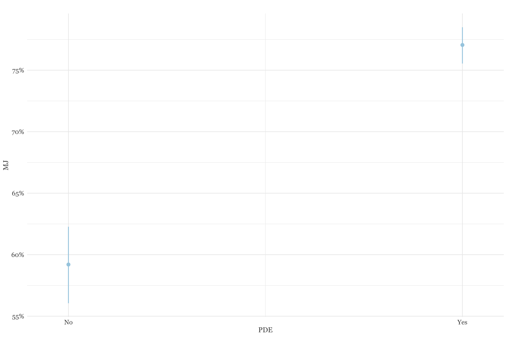
cat('<br></br>')
cat(' <div class="apa-figure-title">   <span class="figure-label">Figure 3.</span><br>
  Predicted probabilities for Agent
</div>
')
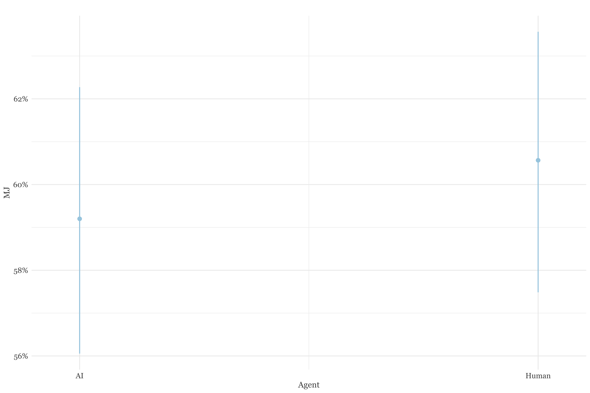
cat('<br></br>')
```

```{r interaction plots, echo=FALSE,results='asis'}

############################################################
# 2. INTERACTION PLOTS
############################################################

cat(' <div class="apa-figure-title">   <span class="figure-label">Figure 4.</span><br>
  Predicted probabilities for PBH x PDE
</div>
')
knitr::include_graphics("figures/Study2_full_interaction_PBH_PDE.png")
cat('<br></br>')
cat(' <div class="apa-figure-title">   <span class="figure-label">Figure 5.</span><br>
  Predicted probabilities for PBH x Agent
</div>
')
knitr::include_graphics("figures/Study2_full_interaction_PBH_Agent.png")
cat('<br></br>')
cat(' <div class="apa-figure-title">   <span class="figure-label">Figure 6.</span><br>
  Predicted probabilities for PDE x Agent
</div>
')
knitr::include_graphics("figures/Study2_full_interaction_PDE_Agent.png")
cat('<br></br>')
cat(' <div class="apa-figure-title">   <span class="figure-label">Figure 7.</span><br>
  Predicted probabilities for PBH x PDE x Agent
</div>
')
knitr::include_graphics("figures/Study2_full_interaction_plot.png")
cat('<br></br>')

```

### Estimated Marginal Means of Main Analysis (by factor)

```{r echo=FALSE,warning=FALSE,results='asis'}
set.platform("tables")
cat('
<div class="apa-table-title">
  <span class="table-label">Table 3.</span> Estimated marginal means by PBH × PDE within Agent
</div>')
includeHTML("Study2_full_EMM_Agent.html")
cat('<br></br>')
cat('
<div class="apa-table-title">
  <span class="table-label">Table 4.</span> Estimated marginal means by PDE x Agent within PBH
</div>')
includeHTML("Study2_full_EMM_PBH.html")

cat('<br></br>')
cat('
<div class="apa-table-title">
  <span class="table-label">Table 5.</span> Estimated marginal means by Agent × PDE within PDE
</div>')
includeHTML("Study2_full_EMM_PDE.html")
cat('<br></br>')

cat('<br></br>')
cat('
<div class="apa-table-title">
  <span class="table-label">Table 4.</span> Estimated marginal means of PDE within PBH
</div>')
includeHTML("Study2_full_EMM_PBH.html")
cat('<br></br>')
```

#### Contrasts of EMMs

```{r contrasts, echo=FALSE, results='asis'}
set.platform("tables")
cat('
<div class="apa-table-title">
  <span class="table-label">Table 6.</span> Pairwise contrasts for PBH × PDE within Agent
</div>')
includeHTML("Study2_full_contrast_Agent.html")

cat('<br></br>')
cat('
<div class="apa-table-title">
  <span class="table-label">Table 7.</span> Pairwise contrasts for PBH × Agent within PBH
</div>')
includeHTML("Study2_full_contrast_PBH.html")


cat('<br></br>')
cat('
<div class="apa-table-title">
  <span class="table-label">Table 8.</span> Pairwise contrasts for PDE × Agent within PDE
</div>')
includeHTML("Study2_full_contrast_PDE.html")
cat('<br></br>')

```

### Two Sided Equivalence Test for Main Analysis

```{r toast w. what actually had power for, echo=FALSE, results='asis'}

cat('<br></br>')
cat('
<div class="apa-table-title">
  <span class="table-label">Table 10.</span> TOST-test for Practical Equivalence for Main Model
</div>')
includeHTML("tables/Study2_full_TOST_table.html")
cat('<br></br>')
set.platform()
cat('<br></br>')
cat(' <div class="apa-figure-title">   <span class="figure-label">Figure 9.</span><br>
  TOST results for Main Analysis 
</div>
')
knitr::include_graphics("figures/Study2_full_TOST_plot.png")
cat('<div style="color: black; font-size: 1em; margin-top: 0.25em;">
<span style="font-style: italic; ">Note.</span> Bounds set to mid-point value of small effect size boundary for log odds (±0.94). This is what the study was actually powered to detect for a three-way interaction. 
</div>')
cat('<br></br>')

```


### Model Comparisons


```{r model comp, eval=FALSE}
model_comp <- compare_performance(Agent, PBH, PDE, PBH_Agent, PDE_Agent, PBH_PDE, hVai)
```

```{r model comp from saved, echo=FALSE, results='asis'}
set.platform("tables")
cat('<br></br>')
cat('
<div class="apa-table-title">
  <span class="table-label">Table 17.</span> Comparison of logistic GLMMs with alternative fixed-factor combinations predicting moral judgments (with RE structure as in final model)
</div>')
includeHTML(("Study2_full_model_comparison.html"))
cat('<div style="color: black; font-size: 1em; margin-top: 0.25em;">
<span style="font-style: italic; ">Note.</span> Lower AIC and BIC indicate better fit.
</div>')
cat('<br></br>')

```


### Model Checks

### Check Model Fit to Distribution

```{r model checks, echo=FALSE, results='asis'}

cat('<div class="apa-figure-title">   <span class="figure-label">Figure X.</span><br>
  Posterior Predictive Check
</div>
')

cat('<div style="color: black; font-size: 1em; margin-top: 0.25em;">
<span style="font-style: italic; ">Note.</span> Model-predicted intervals should include observed data points.
</div>')
cat('<br></br>')
```

This looks good - our model lines up well with the predicted model. Specifically, the observed data falls within the model-predicted intervals. This suggests that our model fits the assumptions of the underlying binomial distribution. 
### Linearity (The logit of the probability is a linear function of the predictors.)

```{r linearity,echo=FALSE, results='asis'}

# This plot helps assess whether the model’s mean structure is correctly specified. It shows whether the predicted probabilities systematically differ from the observed outcomes across the range of fitted values. If the model is appropriate, the binned residuals should cluster around zero with no clear pattern. Systematic curves or trends would suggest that the link function or the functional form of one or more predictors may be misspecified.
cat('<div class="apa-figure-title">   <span class="figure-label">Figure X.</span><br>
  Check of Linearity Assumption (Binned Residuals)
</div>
')
knitr::include_graphics("figures/Study2_full_diagnostic_2.png")
cat('<div style="color: black; font-size: 1em; margin-top: 0.25em;">
<span style="font-style: italic; ">Note.</span> Points should be within error bounds.
</div>')
cat('<br></br>')

```

This isn't quite what we'd want to confirm that the linearity assumption hasn't been violated. So, let's do some further checks. First, let's look at the relationship in more detail to see if we can detect a non-linear relationship (i.e. that the residuals do not follow linearity).

```{r plotting linearity of predicted response, echo=FALSE, results='asis'}

cat('<div class="apa-figure-title">   <span class="figure-label">Figure X.</span><br>
  Checking the Residuals on the Plot of Predicted Probabilities of MJ
</div>
')
knitr::include_graphics("figures/Study2_full_diagnostic_pred_response.png")
cat('<div style="color: black; font-size: 1em; margin-top: 0.25em;">
<span style="font-style: italic; ">Note.</span> The dots are residuals and added lines are residual lines. 
</div>')
cat('<br></br>')
```

This looks pretty good. This, therefore, doesn't suggest a non-linear relationship. We've also already modelled all the interactions for the fixed factors. As a final check here, we can look at the effect of included the interactions for the random factor structure (though this threw a singularity issue, suggesting overfitting).

```{r plotting linearity of predicted response for full model, eval=FALSE, results='asis'}
full.pr <- predict_response(full.hVai, terms = c("PBH [all]","PDE [all] ","Agent [all]"))
cat('<div class="apa-figure-title">   <span class="figure-label">Figure X.</span><br>
  Checking the Residuals on the Plot of Predicted Probabilities of MJ for the Model with Full RE Structure
</div>
')
plot(full.pr, show_residuals = TRUE, show_residuals_line = TRUE,grid=TRUE) + georgia_theme + theme(title = element_blank())
cat('<div style="color: black; font-size: 1em; margin-top: 0.25em;">
<span style="font-style: italic; ">Note.</span> The dots are residuals and added lines are residual lines. 
</div>')
cat('<br></br>')
```

Although this does fit the data a *little* better, it doesn't make that much difference overall. As such plots of linearity should be taken with caution anyway, this helps us be more confident that we don't have a "lack of fit" issue.

### Dispersion

(Binomial equivalent to checking for dispersion) The posterior predictive check also helps us check for dispersion. We already did this when checking the model fit. 
We can also test with the nonparametric dispersion test from DHARMa.

```{r dispersion check, echo=FALSE, results='asis'}
p <- testDispersion(hVai,plot=F) 
cat('**Written output of DHARMa nonparametric dispersion test via sd of residuals fitted vs. simulated :**', 
    '\n\n',
    'Dispersion:', p[["statistic"]],
    '\n\n',
    '*p*:', p[["p.value"]])
```
As we can see, this test of dispersion from the DHARMa package is non-significant, meaning there isn't any significant dispersion of our observed residuals to those of a normally distributed set of residuals. 
Together with our posterior predictive check analysis (and further steps taken as a result), we can rule out any concerns here. 

### Outliers

```{r outliers,echo=FALSE, results='asis'}

# This plot helps assess whether the model’s mean structure is correctly specified. It shows whether the predicted probabilities systematically differ from the observed outcomes across the range of fitted values. If the model is appropriate, the binned residuals should cluster around zero with no clear pattern. Systematic curves or trends would suggest that the link function or the functional form of one or more predictors may be misspecified.
cat('<div class="apa-figure-title">   <span class="figure-label">Figure X.</span><br>
  Check for Outliers (Influential Observations)
</div>
')
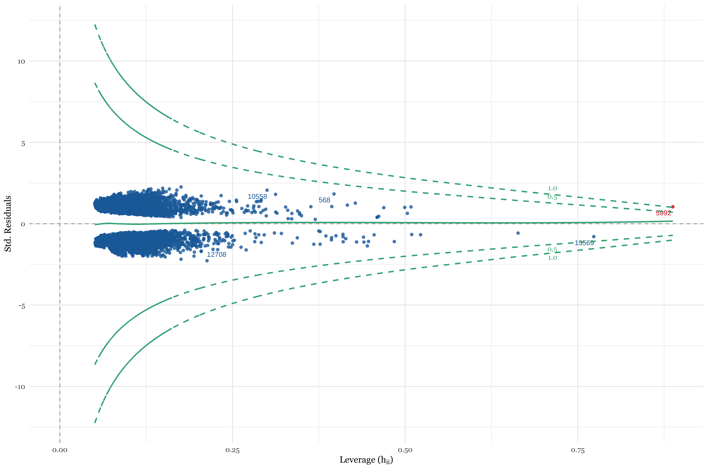
cat('<div style="color: black; font-size: 1em; margin-top: 0.25em;">
<span style="font-style: italic; ">Note.</span> Points should be inside the contour lines.
</div>')
cat('<br></br>')

```

Before checking these influential observations individually, we tested whether the residuals significantly deviate from the expected uniform distribution under the model.  
```{r simsResid outliers, echo=FALSE,results='asis'}
simResid <- simulate_residuals(hVai)
out_obj <- performance::check_outliers(simResid)
cat('**Written output of outlier detection test:**', 
    '\n\n',
    'Proportion of observed outliers:', out_obj[["Coefficient"]],
    '\n\n',
    'Proportion of expected outliers:', out_obj[["Expected"]], '95% CI [', out_obj[["CI_low"]],',',out_obj[["CI_high"]],']',
    '\n\n',
    'No outliers were detected (*p*:', out_obj[["p_value"]],').')
```

As we can see, this does not flag any outliers, suggesting the highlighted cases in the Cook's distance plot, while influential, do not represent residual outliers.

#### Collinearity

```{r collinearity,echo=FALSE, results='asis'}

# This plot helps assess whether the model’s mean structure is correctly specified. It shows whether the predicted probabilities systematically differ from the observed outcomes across the range of fitted values. If the model is appropriate, the binned residuals should cluster around zero with no clear pattern. Systematic curves or trends would suggest that the link function or the functional form of one or more predictors may be misspecified.
cat('<div class="apa-figure-title">   <span class="figure-label">Figure X.</span><br>
  Check for Collinearity
</div>
')
knitr::include_graphics("figures/Study2_full_diagnostic_4.png")
cat('<div style="color: black; font-size: 1em; margin-top: 0.25em;">
<span style="font-style: italic; ">Note.</span> High collinearity variation inflation factor (VIF) may inflate parameter uncertainty.
</div>')
cat('<br></br>')

```

The VIF's for all parameters are low which means that each predictor does not correlate with the other predictors in such a way that might suggest that the value of all additional predictors/parameters added to the model is low. This would be consistent with our model comparison findings, where we see that the fullest model we can fit has the lowest AIC and BIC values than all other reduced models. 

####Normality of Residuals

```{r normality of resid,echo=FALSE, results='asis'}

# This plot helps assess whether the model’s mean structure is correctly specified. It shows whether the predicted probabilities systematically differ from the observed outcomes across the range of fitted values. If the model is appropriate, the binned residuals should cluster around zero with no clear pattern. Systematic curves or trends would suggest that the link function or the functional form of one or more predictors may be misspecified.
cat('<div class="apa-figure-title">   <span class="figure-label">Figure X.</span><br>
  Checking for Uniformity of Residuals (QQ Plot) 
</div>
')
knitr::include_graphics("figures/Study2_full_diagnostic_5.png")
cat('<div style="color: black; font-size: 1em; margin-top: 0.25em;">
<span style="font-style: italic; ">Note.</span> Points should be inside the contour lines.
</div>')
cat('<br></br>')

```
Our residuals show a good fit with the standard quantiles of a normal uniform distribution. 

### Normality of Random Effects

#### Participants

```{r RE normality,echo=FALSE, results='asis'}

# Display the first plot
# Uniformity of Residuals
# Dots should fall along the lines
cat('<div class="apa-figure-title">   <span class="figure-label">Figure X.</span><br>
  Checking for Normality of Participants Random Effect 
</div>
')
knitr::include_graphics("figures/Study2_full_diagnostic_6.png")
cat('<div style="color: black; font-size: 1em; margin-top: 0.25em;">
<span style="font-style: italic; ">Note.</span> Dot should be plotted along the line.
</div>')
cat('<br></br>')
```

#### Dilemmas

```{r dilemma RE normality,echo=FALSE, results='asis'}

cat('<div class="apa-figure-title">   <span class="figure-label">Figure X.</span><br>
  Checking for Normality of Dilemmas Random Effect 
</div>
')
knitr::include_graphics("figures/Study2_full_diagnostic_7.png")
cat('<div style="color: black; font-size: 1em; margin-top: 0.25em;">
<span style="font-style: italic; ">Note.</span> Dot should be plotted along the line.
</div>')
cat('<br></br>')

```

Both of our random factors look good and fit the assumptions of a normal distribution. 

## Removing dilemmas with ambiguous MG predictions
The additional dilemmas developed in-lab did not have explicit predictions in the MG model. For the most part, these could be estimated based off of the predictions made for alternative dilemmas, and/or guided by the fulfilments of PBH/PDE. However, the unprohibited better alternative equipment-only disproportionate cost intended and the unprohibited better alternative disproportionate cost scenarios had particularly ambiguous estimates. Therefore, for the first study and this study, I conduct analyses with, and without, these dilemmas. Until, at least there is sufficient information available to provide more appropriate predictions. 

First, the GLMM model was fit with a full random effects structure.

```{r reduced model w. reduced RE structure, eval=FALSE,echo=TRUE}
full.hVai <- glmer(MJ ~ PBH*PDE*Agent +  (1+PBH*PDE*Agent|ID) + (1+Agent|dilemma),  data=reduced_df, family = binomial(link = "logit"),
                   control = glmerControl(optCtrl = list(maxfun = 2e5), optimizer = "bobyqa"))
```

```{r read in reduced model, echo=FALSE}
set.platform("outputs")
full.hVai <- readRDS("reducedRE_hVai_reduced_glmModel.rds")
```

This returned a singularity issue. Therefore, the complexity of the random effects structure was reduced (by order of importance) until no singularity warning was returned. The model below was the final fitted model.

```{r reduced model w. simplified RE structure, eval=FALSE,echo=TRUE}
hVai <- glmer(MJ ~ PBH*PDE*Agent +  (1+PBH+PDE|ID) + (1|Dilemma),  data=reduced_df, family = binomial(link = "logit"),
              control = glmerControl(optCtrl = list(maxfun = 2e5), optimizer = "bobyqa"))

#OR coefficients 
OR_hVai <- exp(fixef(hVai))
#CIs
ci_hVai <- confint(hVai, method = "Wald")
ci_hVai.or <- exp(ci_hVai)
ses_hVai <- sqrt(diag(vcov(hVai)))
```

```{r reduced model w. reduced RE structure from saved, echo=FALSE}
set.platform("outputs")
hVai <- readRDS("dropAgentIDdilRE_hVai_reduced_glmModel.rds")
#OR coefficients 
OR_hVai <- exp(fixef(hVai))
# confidence intervals for log-odds and OR
ci_hVai <- confint(hVai, method = "Wald") 
ci_hVai.or <- exp(ci_hVai)
ses_hVai <- sqrt(diag(vcov(hVai)))
```

```{r summary reduced,results='asis',echo=FALSE,cache=FALSE}

cat('
<div class="apa-table-title">
  <span class="table-label">Table 2.</span> Logistic GLMM Human v AI MJs explained by MG (OR)
</div>')
# OR table
tmp <- URLencode(paste(readLines("tables/Study2_reduced_regression_OR.html"), collapse="\n"))

cat('<iframe src="data:text/html;charset=utf-8,', tmp ,
    '" style="border: none; seamless:seamless; width: 800px; height: 200px"></iframe>')
cat('</td>')
cat('<td style="vertical-align:top; width:100%; padding:4px;">')
cat('<table style="width:100%; table-layout:fixed;"><tr>')
cat('<td style="vertical-align:top; width:100%; padding:10px;">')
cat('
<div class="apa-table-title">
  <span class="table-label">Table 1.</span> Logistic GLMM Human v AI MJs explained by MG (Log Odds)
</div>')
# log-odds table
tmp <- URLencode(paste(readLines("tables/Study2_reduced_regression_logodds.html"), collapse="\n"))

cat('<iframe src="data:text/html;charset=utf-8,', tmp ,
    '" style="border: none; seamless:seamless; width: 800px; height: 200px"></iframe>')
cat('</td></tr></table>')

```

```{r hVai reduced report,eval=FALSE}
hVai_report <- report(hVai)   
hVai_report
```


```{r plot models for reduced, echo=FALSE, results='asis',out.width="80%"}

# combine rows
cat(' <div class="apa-figure-title">   <span class="figure-label">Figure 1.</span><br>
  Predicted probabilities for PBH
</div>
')
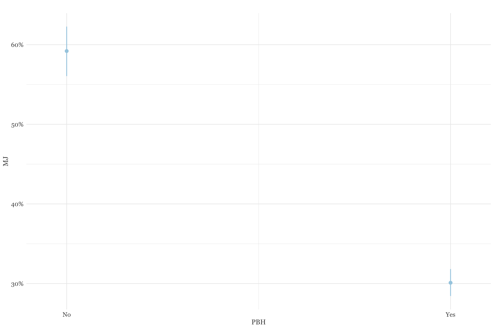
cat('<br></br>')
cat(' <div class="apa-figure-title">   <span class="figure-label">Figure 2.</span><br>
  Predicted probabilities for PDE
</div>
')
knitr::include_graphics("figures/Study2_reduced_pred_PDE.png")
cat('<br></br>')
cat(' <div class="apa-figure-title">   <span class="figure-label">Figure 3.</span><br>
  Predicted probabilities for Agent
</div>
')
knitr::include_graphics("figures/Study2_reduced_pred_Agent.png")
cat('<br></br>')
```

```{r interaction plots for reduced, echo=FALSE,results='asis'}

############################################################
# 2. INTERACTION PLOTS
############################################################

cat(' <div class="apa-figure-title">   <span class="figure-label">Figure 4.</span><br>
  Predicted probabilities for PBH x PDE
</div>
')
knitr::include_graphics("figures/Study2_reduced_interaction_PBH_PDE.png")
cat('<br></br>')
cat(' <div class="apa-figure-title">   <span class="figure-label">Figure 5.</span><br>
  Predicted probabilities for PBH x Agent
</div>
')
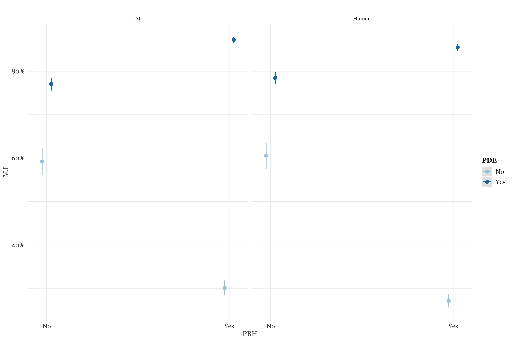
cat('<br></br>')
cat(' <div class="apa-figure-title">   <span class="figure-label">Figure 6.</span><br>
  Predicted probabilities for PDE x Agent
</div>
')
knitr::include_graphics("figures/Study2_reduced_interaction_PDE_Agent.png")
cat('<br></br>')
cat(' <div class="apa-figure-title">   <span class="figure-label">Figure 7.</span><br>
  Predicted probabilities for PBH x PDE x Agent
</div>
')
knitr::include_graphics("figures/Study2_reduced_interaction_plot.png")
cat('<br></br>')

```

### Estimated Marginal Means of Main Analysis (by factor)

```{r EMMs for reduced, echo=FALSE,warning=FALSE,results='asis'}
set.platform("tables")
cat('
<div class="apa-table-title">
  <span class="table-label">Table 3.</span> Estimated marginal means by PBH × PDE within Agent
</div>')
includeHTML("Study2_reduced_EMM_Agent.html")
cat('<br></br>')
cat('
<div class="apa-table-title">
  <span class="table-label">Table 4.</span> Estimated marginal means by PDE x Agent within PBH
</div>')
includeHTML("Study2_reduced_EMM_PBH.html")

cat('<br></br>')
cat('
<div class="apa-table-title">
  <span class="table-label">Table 5.</span> Estimated marginal means by Agent × PDE within PDE
</div>')
includeHTML("Study2_reduced_EMM_PDE.html")
cat('<br></br>')

cat('<br></br>')
cat('
<div class="apa-table-title">
  <span class="table-label">Table 4.</span> Estimated marginal means of PDE within PBH
</div>')
includeHTML("Study2_reduced_EMM_PBH.html")
cat('<br></br>')
```

#### Contrasts of EMMs

```{r contrasts for reduced, echo=FALSE, results='asis'}
set.platform("tables")
cat('
<div class="apa-table-title">
  <span class="table-label">Table 6.</span> Pairwise contrasts for PBH × PDE within Agent
</div>')
includeHTML("Study2_reduced_contrast_Agent.html")

cat('<br></br>')
cat('
<div class="apa-table-title">
  <span class="table-label">Table 7.</span> Pairwise contrasts for PBH × Agent within PBH
</div>')
includeHTML("Study2_reduced_contrast_PBH.html")


cat('<br></br>')
cat('
<div class="apa-table-title">
  <span class="table-label">Table 8.</span> Pairwise contrasts for PDE × Agent within PDE
</div>')
includeHTML("Study2_reduced_contrast_PDE.html")
cat('<br></br>')

```

### Two Sided Equivalence Test for Main Analysis

```{r toast w. what actually had power for, for reduced, echo=FALSE, results='asis'}

cat('<br></br>')
cat('
<div class="apa-table-title">
  <span class="table-label">Table 10.</span> TOST-test for Practical Equivalence for Main Model
</div>')
includeHTML("tables/Study2_reduced_TOST_table.html")
cat('<br></br>')
set.platform()
cat('<br></br>')
cat(' <div class="apa-figure-title">   <span class="figure-label">Figure 9.</span><br>
  TOST results for Main Analysis 
</div>
')
knitr::include_graphics("figures/Study2_reduced_TOST_plot.png")
cat('<div style="color: black; font-size: 1em; margin-top: 0.25em;">
<span style="font-style: italic; ">Note.</span> Bounds set to mid-point value of small effect size boundary for log odds (±0.94). This is what the study was actually powered to detect for a three-way interaction. 
</div>')
cat('<br></br>')

```


### Model Comparisons


```{r model comp for reduced, eval=FALSE}
model_comp <- compare_performance(Agent, PBH, PDE, PBH_Agent, PDE_Agent, PBH_PDE, hVai)
```

```{r model comp from saved for reduced, echo=FALSE, results='asis'}
set.platform("tables")
cat('<br></br>')
cat('
<div class="apa-table-title">
  <span class="table-label">Table 17.</span> Comparison of logistic GLMMs with alternative fixed-factor combinations predicting moral judgments (with RE structure as in final model)
</div>')
includeHTML(("Study2_reduced_model_comparison.html"))
cat('<div style="color: black; font-size: 1em; margin-top: 0.25em;">
<span style="font-style: italic; ">Note.</span> Lower AIC and BIC indicate better fit.
</div>')
cat('<br></br>')

```


### Model Checks

#### Check Model Fit to Distribution

```{r model checks for reduced, echo=FALSE, results='asis'}

cat('<div class="apa-figure-title">   <span class="figure-label">Figure X.</span><br>
  Posterior Predictive Check
</div>
')
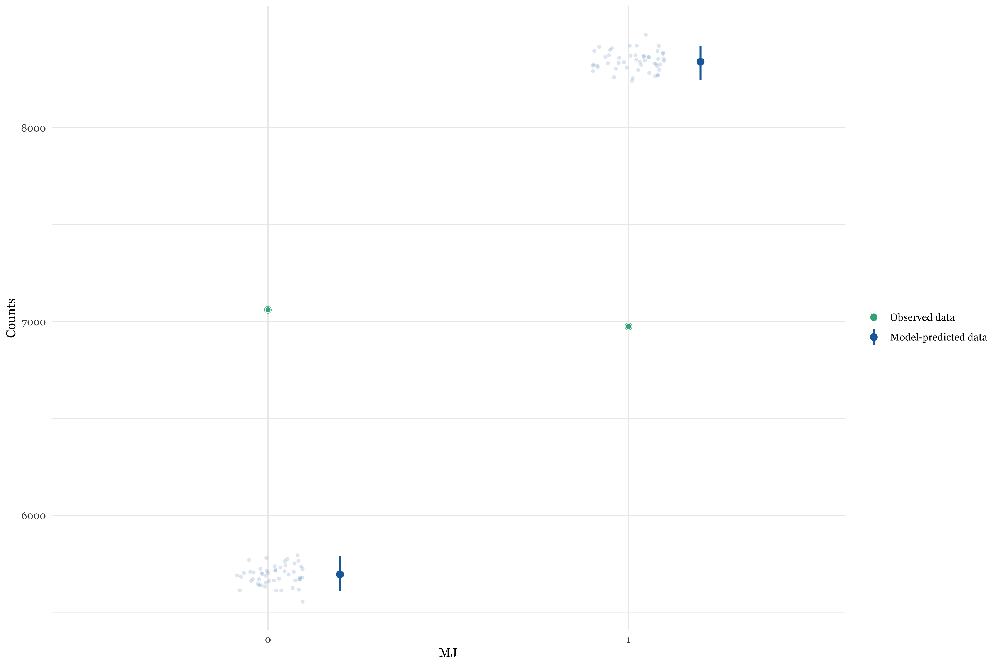
cat('<div style="color: black; font-size: 1em; margin-top: 0.25em;">
<span style="font-style: italic; ">Note.</span> Model-predicted intervals should include observed data points.
</div>')
cat('<br></br>')
```

This looks good - our model lines up well with the predicted model. Specifically, the observed data falls within the model-predicted intervals. This suggests that our model fits the assumptions of the underlying binomial distribution. 
#### Linearity (The logit of the probability is a linear function of the predictors.)

```{r linearity for reduced,echo=FALSE, results='asis'}

# This plot helps assess whether the model’s mean structure is correctly specified. It shows whether the predicted probabilities systematically differ from the observed outcomes across the range of fitted values. If the model is appropriate, the binned residuals should cluster around zero with no clear pattern. Systematic curves or trends would suggest that the link function or the functional form of one or more predictors may be misspecified.
cat('<div class="apa-figure-title">   <span class="figure-label">Figure X.</span><br>
  Check of Linearity Assumption (Binned Residuals)
</div>
')
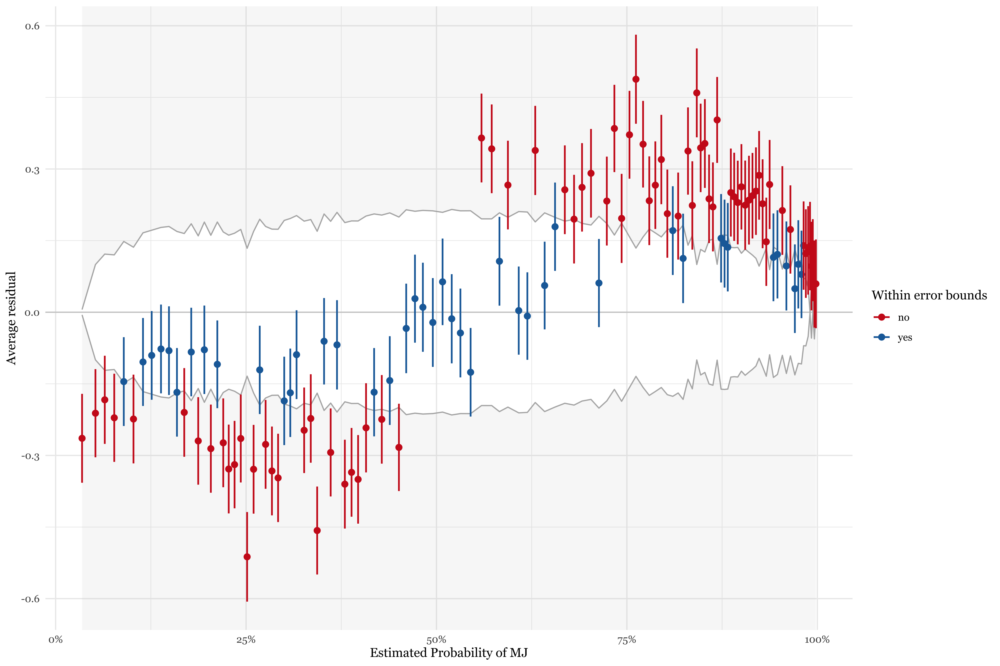
cat('<div style="color: black; font-size: 1em; margin-top: 0.25em;">
<span style="font-style: italic; ">Note.</span> Points should be within error bounds.
</div>')
cat('<br></br>')

```

This isn't quite what we'd want to confirm that the linearity assumption hasn't been violated. So, let's do some further checks. First, let's look at the relationship in more detail to see if we can detect a non-linear relationship (i.e. that the residuals do not follow linearity).

```{r plotting linearity of predicted response for reduced, echo=FALSE, results='asis'}

cat('<div class="apa-figure-title">   <span class="figure-label">Figure X.</span><br>
  Checking the Residuals on the Plot of Predicted Probabilities of MJ
</div>
  ')
knitr::include_graphics("figures/Study2_reduced_diagnostic_pred_response.png")
cat('<div style="color: black; font-size: 1em; margin-top: 0.25em;">
  <span style="font-style: italic; ">Note.</span> The dots are residuals and added lines are residual lines. 
</div>')
cat('<br></br>')
```

This looks pretty good. This, therefore, doesn't suggest a non-linear relationship. We've also already modelled all the interactions for the fixed factors. As a final check here, we can look at the effect of included the interactions for the random factor structure (though this threw a singularity issue, suggesting overfitting).

```{r plotting linearity of predicted response for reduced model w. red data, eval=FALSE, results='asis'}
reduced.pr <- predict_response(full.hVai, terms = c("PBH [all]","PDE [all] ","Agent [all]"))
cat('<div class="apa-figure-title">   <span class="figure-label">Figure X.</span><br>
  Checking the Residuals on the Plot of Predicted Probabilities of MJ for the Model with reduced RE Structure
</div>
  ')
plot(reduced.pr, show_residuals = TRUE, show_residuals_line = TRUE,grid=TRUE) + georgia_theme + theme(title = element_blank())
cat('<div style="color: black; font-size: 1em; margin-top: 0.25em;">
  <span style="font-style: italic; ">Note.</span> The dots are residuals and added lines are residual lines. 
</div>')
cat('<br></br>')
```

Although this does fit the data a *little* better, it doesn't make that much difference overall. As such plots of linearity should be taken with caution anyway, this helps us be more confident that we don't have a "lack of fit" issue.

#### Dispersion

(Binomial equivalent to checking for dispersion) The posterior predictive check also helps us check for dispersion. We already did this when checking the model fit. 
We can also test with the nonparametric dispersion test from DHARMa.

```{r dispersion check for reduced, echo=FALSE, results='asis'}
p <- testDispersion(hVai,plot=F) 
cat('**Written output of DHARMa nonparametric dispersion test via sd of residuals fitted vs. simulated :**', 
    '\n\n',
    'Dispersion:', p[["statistic"]],
    '\n\n',
    '*p*:', p[["p.value"]])
```
As we can see, this test of dispersion from the DHARMa package is non-significant, meaning there isn't any significant dispersion of our observed residuals to those of a normally distributed set of residuals. 
Together with our posterior predictive check analysis (and further steps taken as a result), we can rule out any concerns here. 

#### Outliers

```{r outliers for reduced,echo=FALSE, results='asis'}

# This plot helps assess whether the model’s mean structure is correctly specified. It shows whether the predicted probabilities systematically differ from the observed outcomes across the range of fitted values. If the model is appropriate, the binned residuals should cluster around zero with no clear pattern. Systematic curves or trends would suggest that the link function or the functional form of one or more predictors may be misspecified.
cat('<div class="apa-figure-title">   <span class="figure-label">Figure X.</span><br>
  Check for Outliers (Influential Observations)
</div>
')
knitr::include_graphics("figures/Study2_reduced_diagnostic_3.png")
cat('<div style="color: black; font-size: 1em; margin-top: 0.25em;">
<span style="font-style: italic; ">Note.</span> Points should be inside the contour lines.
</div>')
cat('<br></br>')

```

Before checking these influential observations individually, we tested whether the residuals significantly deviate from the expected uniform distribution under the model.  
```{r simsResid outliers for reduced, echo=FALSE,results='asis'}
simResid <- simulate_residuals(hVai)
out_obj <- performance::check_outliers(simResid)
cat('**Written output of outlier detection test:**', 
    '\n\n',
    'Proportion of observed outliers:', out_obj[["Coefficient"]],
    '\n\n',
    'Proportion of expected outliers:', out_obj[["Expected"]], '95% CI [', out_obj[["CI_low"]],',',out_obj[["CI_high"]],']',
    '\n\n',
    'No outliers were detected (*p*:', out_obj[["p_value"]],').')
```

As we can see, this does not flag any outliers, suggesting the highlighted cases in the Cook's distance plot, while influential, do not represent residual outliers.

#### Collinearity

```{r collinearity for reduced,echo=FALSE, results='asis'}

# This plot helps assess whether the model’s mean structure is correctly specified. It shows whether the predicted probabilities systematically differ from the observed outcomes across the range of fitted values. If the model is appropriate, the binned residuals should cluster around zero with no clear pattern. Systematic curves or trends would suggest that the link function or the functional form of one or more predictors may be misspecified.
cat('<div class="apa-figure-title">   <span class="figure-label">Figure X.</span><br>
  Check for Collinearity
</div>
  ')
knitr::include_graphics("figures/Study2_reduced_diagnostic_4.png")
cat('<div style="color: black; font-size: 1em; margin-top: 0.25em;">
  <span style="font-style: italic; ">Note.</span> High collinearity variation inflation factor (VIF) may inflate parameter uncertainty.
</div>')
cat('<br></br>')

```

The VIF's for all parameters are low which means that each predictor does not correlate with the other predictors in such a way that might suggest that the value of all additional predictors/parameters added to the model is low. This would be consistent with our model comparison findings, where we see that the reducedest model we can fit has the lowest AIC and BIC values than all other reduced models. 

#### Normality of Residuals

```{r normality of resid for reduced,echo=FALSE, results='asis'}

# This plot helps assess whether the model’s mean structure is correctly specified. It shows whether the predicted probabilities systematically differ from the observed outcomes across the range of fitted values. If the model is appropriate, the binned residuals should cluster around zero with no clear pattern. Systematic curves or trends would suggest that the link function or the functional form of one or more predictors may be misspecified.
cat('<div class="apa-figure-title">   <span class="figure-label">Figure X.</span><br>
  Checking for Uniformity of Residuals (QQ Plot) 
</div>
')
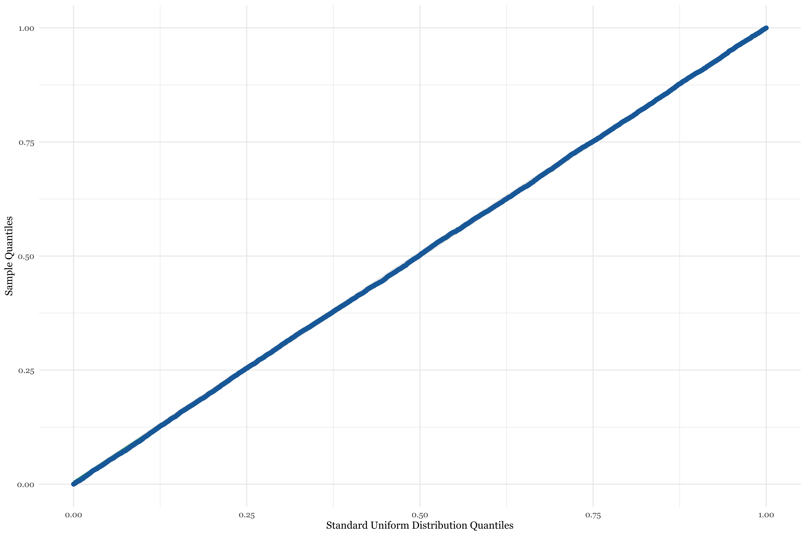
cat('<div style="color: black; font-size: 1em; margin-top: 0.25em;">
<span style="font-style: italic; ">Note.</span> Points should be inside the contour lines.
</div>')
cat('<br></br>')

```
Our residuals show a good fit with the standard quantiles of a normal uniform distribution. 

#### Normality of Random Effects

##### Participants

```{r RE normality for reduced,echo=FALSE, results='asis'}

# Display the first plot
# Uniformity of Residuals
# Dots should fall along the lines
cat('<div class="apa-figure-title">   <span class="figure-label">Figure X.</span><br>
  Checking for Normality of Participants Random Effect 
</div>
')
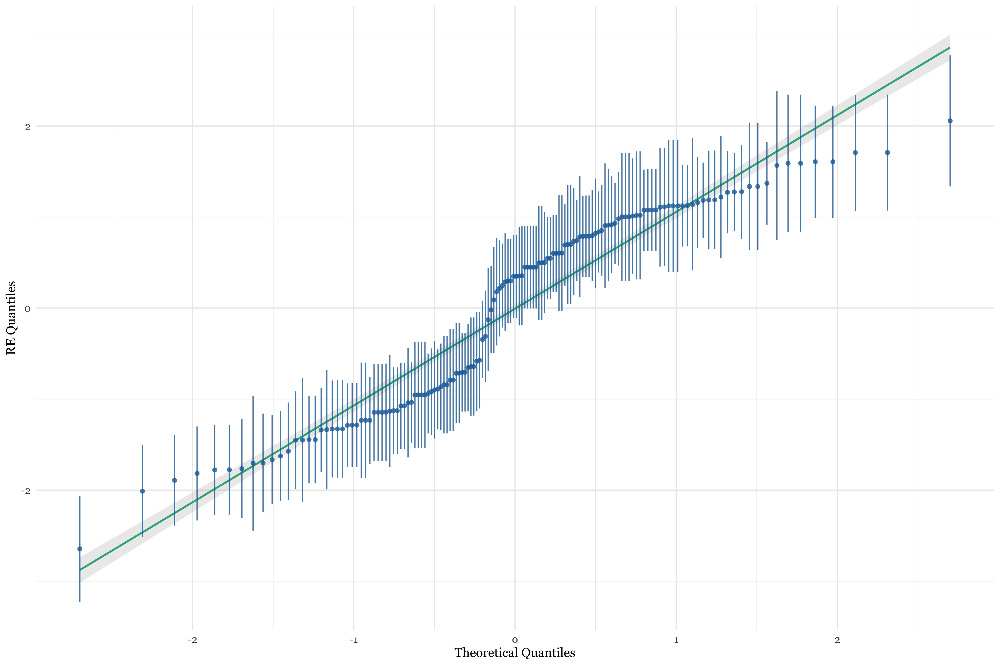
cat('<div style="color: black; font-size: 1em; margin-top: 0.25em;">
<span style="font-style: italic; ">Note.</span> Dot should be plotted along the line.
</div>')
cat('<br></br>')
```

##### Dilemmas

```{r dilemma RE normality for reduced,echo=FALSE, results='asis'}

cat('<div class="apa-figure-title">   <span class="figure-label">Figure X.</span><br>
  Checking for Normality of Dilemmas Random Effect 
</div>
')
knitr::include_graphics("figures/Study2_reduced_diagnostic_7.png")
cat('<div style="color: black; font-size: 1em; margin-top: 0.25em;">
<span style="font-style: italic; ">Note.</span> Dot should be plotted along the line.
</div>')
cat('<br></br>')

```

Both of our random factors look good and fit the assumptions of a normal distribution. 
<!--
## Modelling RT (log-transformed) as DV
First, the GLMM model was fit with a RT random effects structure.

```{r RT model w. RT RE structure, eval=FALSE,echo=TRUE}
full.hVai <- glmer(logRT ~ PBH*PDE*Agent +  (1+PBH*PDE*Agent|ID) + (1+Agent|dilemma),  data=df, family = binomial(link = "logit"),
                      control = glmerControl(optCtrl = list(maxfun = 2e5), optimizer = "bobyqa"))
```

```{r read in RT model, echo=FALSE}
set.platform("outputs")
hVai <- readRDS("dropAgentIDdilRE_hVai_RT_glmModel.rds")
```

This returned a singularity issue. Therefore, the complexity of the random effects structure was RT (by order of importance) until no singularity warning was returned. The model below was the final fitted model.

```{r RT model w. simplified RE structure, eval=FALSE,echo=TRUE}
hVai <- glmer(logRT ~ PBH*PDE*Agent +  (1+PBH+PDE|ID) + (1|Dilemma),  data=df, family = binomial(link = "logit"),
              control = glmerControl(optCtrl = list(maxfun = 2e5), optimizer = "bobyqa"))

#OR coefficients 
OR_hVai <- exp(fixef(hVai))
#CIs
ci_hVai <- confint(hVai, method = "Wald")
ci_hVai.or <- exp(ci_hVai)
ses_hVai <- sqrt(diag(vcov(hVai)))
```

```{r RT model w. RT RE structure from saved, echo=FALSE}
set.platform("outputs")
hVai <- readRDS("dropAgentIDdilRE_hVai_RT_glmModel.rds")
#OR coefficients 
OR_hVai <- exp(fixef(hVai))
# confidence intervals for log-odds and OR
ci_hVai <- confint(hVai, method = "Wald") 
ci_hVai.or <- exp(ci_hVai)
ses_hVai <- sqrt(diag(vcov(hVai)))
```

```{r summary RT,results='asis',echo=FALSE,cache=FALSE}

cat('
<div class="apa-table-title">
  <span class="table-label">Table 2.</span> logRTs explained by MG (OR)
</div>')
# OR table
tmp <- URLencode(paste(readLines("tables/Study2_RT_regression_OR.html"), collapse="\n"))

cat('<iframe src="data:text/html;charset=utf-8,', tmp ,
    '" style="border: none; seamless:seamless; width: 800px; height: 200px"></iframe>')
cat('</td>')
cat('<td style="vertical-align:top; width:100%; padding:4px;">')
cat('<table style="width:100%; table-layout:fixed;"><tr>')
cat('<td style="vertical-align:top; width:100%; padding:10px;">')
cat('
<div class="apa-table-title">
  <span class="table-label">Table 1.</span> LogRTs explained by MG (Log Odds)
</div>')
# log-odds table
tmp <- URLencode(paste(readLines("tables/Study2_RT_regression_logodds.html"), collapse="\n"))

cat('<iframe src="data:text/html;charset=utf-8,', tmp ,
    '" style="border: none; seamless:seamless; width: 800px; height: 200px"></iframe>')
cat('</td></tr></table>')

```

```{r hVai RT report,eval=FALSE}
hVai_report <- report(hVai)   
hVai_report
```


```{r plot models for RT, echo=FALSE, results='asis',out.width="80%"}

# combine rows
cat(' <div class="apa-figure-title">   <span class="figure-label">Figure 1.</span><br>
  Predicted probabilities for PBH
</div>
')
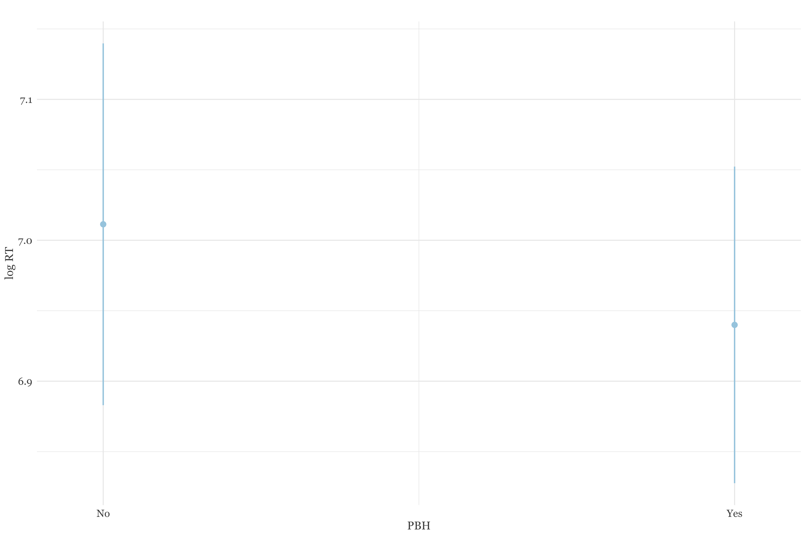
cat('<br></br>')
cat(' <div class="apa-figure-title">   <span class="figure-label">Figure 2.</span><br>
  Predicted probabilities for PDE
</div>
')
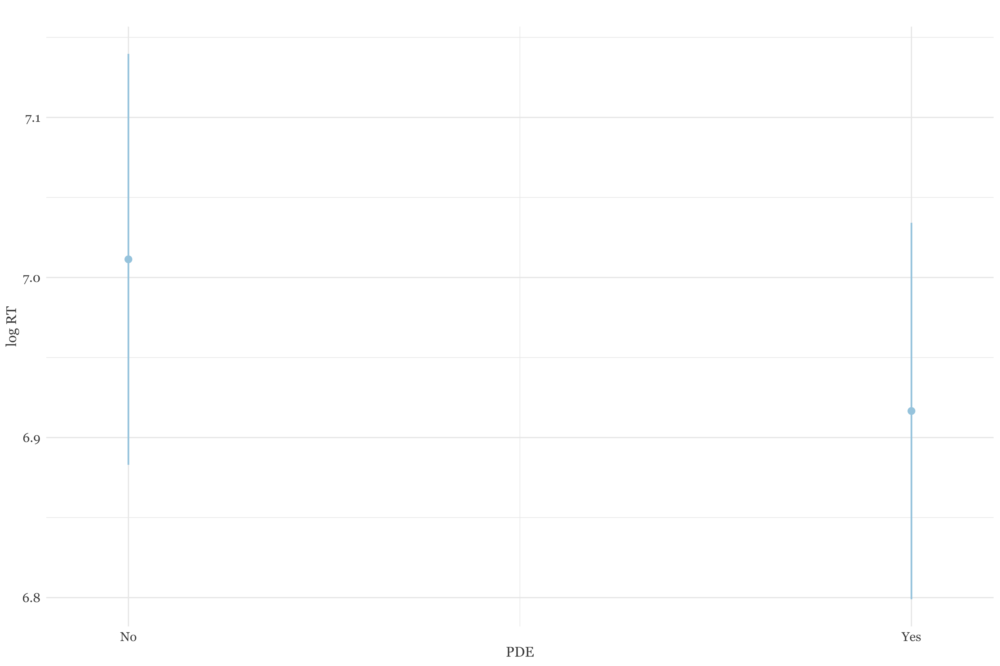
cat('<br></br>')
cat(' <div class="apa-figure-title">   <span class="figure-label">Figure 3.</span><br>
  Predicted probabilities for Agent
</div>
')
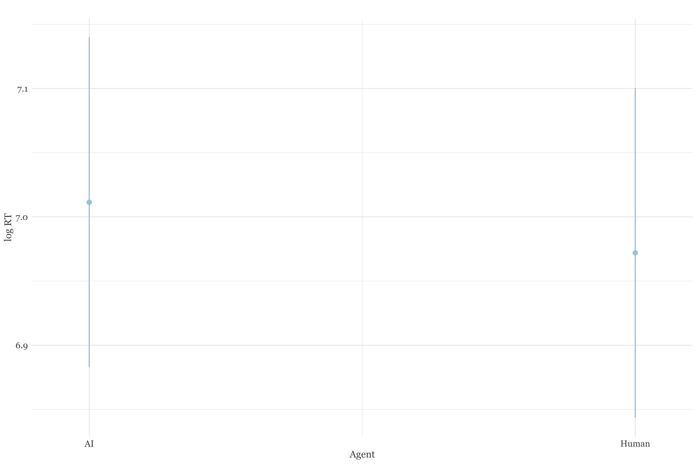
cat('<br></br>')
```

```{r interaction plots for RT, echo=FALSE,results='asis'}

############################################################
# 2. INTERACTION PLOTS
############################################################

cat(' <div class="apa-figure-title">   <span class="figure-label">Figure 4.</span><br>
  Predicted probabilities for PBH x PDE
</div>
')
knitr::include_graphics("figures/Study2_RT_interaction_PBH_PDE.png")
cat('<br></br>')
cat(' <div class="apa-figure-title">   <span class="figure-label">Figure 5.</span><br>
  Predicted probabilities for PBH x Agent
</div>
')
knitr::include_graphics("figures/Study2_RT_interaction_PBH_Agent.png")
cat('<br></br>')
cat(' <div class="apa-figure-title">   <span class="figure-label">Figure 6.</span><br>
  Predicted probabilities for PDE x Agent
</div>
')
knitr::include_graphics("figures/Study2_RT_interaction_PDE_Agent.png")
cat('<br></br>')
cat(' <div class="apa-figure-title">   <span class="figure-label">Figure 7.</span><br>
  Predicted probabilities for PBH x PDE x Agent
</div>
')
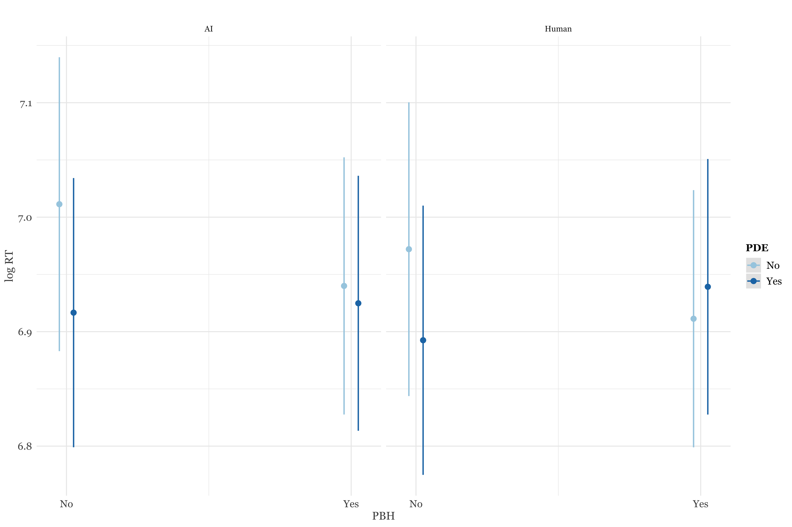
cat('<br></br>')

```

### Estimated Marginal Means of Main Analysis (by factor)

```{r EMMs for RT, echo=FALSE,warning=FALSE,results='asis'}
set.platform("tables")
cat('
<div class="apa-table-title">
  <span class="table-label">Table 3.</span> Estimated marginal means by PBH × PDE within Agent
</div>')
includeHTML("Study2_RT_EMM_Agent.html")
cat('<br></br>')
cat('
<div class="apa-table-title">
  <span class="table-label">Table 4.</span> Estimated marginal means by PDE x Agent within PBH
</div>')
includeHTML("Study2_RT_EMM_PBH.html")

cat('<br></br>')
cat('
<div class="apa-table-title">
  <span class="table-label">Table 5.</span> Estimated marginal means by Agent × PDE within PDE
</div>')
includeHTML("Study2_RT_EMM_PDE.html")
cat('<br></br>')

cat('<br></br>')
cat('
<div class="apa-table-title">
  <span class="table-label">Table 4.</span> Estimated marginal means of PDE within PBH
</div>')
includeHTML("Study2_RT_EMM_PBH.html")
cat('<br></br>')
```

#### Contrasts of EMMs

```{r contrasts for RT, echo=FALSE, results='asis'}
set.platform("tables")
cat('
<div class="apa-table-title">
  <span class="table-label">Table 6.</span> Pairwise contrasts for PBH × PDE within Agent
</div>')
includeHTML("Study2_RT_contrast_Agent.html")

cat('<br></br>')
cat('
<div class="apa-table-title">
  <span class="table-label">Table 7.</span> Pairwise contrasts for PBH × Agent within PBH
</div>')
includeHTML("Study2_RT_contrast_PBH.html")


cat('<br></br>')
cat('
<div class="apa-table-title">
  <span class="table-label">Table 8.</span> Pairwise contrasts for PDE × Agent within PDE
</div>')
includeHTML("Study2_RT_contrast_PDE.html")
cat('<br></br>')

```

### Two Sided Equivalence Test for Main Analysis

```{r toast w. what actually had power for, for RT, echo=FALSE, results='asis'}

cat('<br></br>')
cat('
<div class="apa-table-title">
  <span class="table-label">Table 10.</span> TOST-test for Practical Equivalence for Main Model
</div>')
includeHTML("tables/Study2_RT_TOST_table.html")
cat('<br></br>')
set.platform()
cat('<br></br>')
cat(' <div class="apa-figure-title">   <span class="figure-label">Figure 9.</span><br>
  TOST results for Main Analysis 
</div>
')
knitr::include_graphics("figures/Study2_RT_TOST_plot.png")
cat('<div style="color: black; font-size: 1em; margin-top: 0.25em;">
<span style="font-style: italic; ">Note.</span> Bounds set to lowest threshold for small effect size (Cohen\' d = 0.2) converted to the log-transformed scale for RT.
</div>')
cat('<br></br>')

```


### Model Comparisons


```{r model comp for RT, eval=FALSE}
model_comp <- compare_performance(Agent, PBH, PDE, PBH_Agent, PDE_Agent, PBH_PDE, hVai)
```

```{r model comp from saved for RT, echo=FALSE, results='asis'}
set.platform("tables")
cat('<br></br>')
cat('
<div class="apa-table-title">
  <span class="table-label">Table 17.</span> Comparison of logRT GLMMs with alternative fixed-factor combinations predicting moral judgments (with RE structure as in final model)
</div>')
includeHTML(("Study2_RT_model_comparison.html"))
cat('<div style="color: black; font-size: 1em; margin-top: 0.25em;">
<span style="font-style: italic; ">Note.</span> Lower AIC and BIC indicate better fit.
</div>')
cat('<br></br>')

```


### Model Checks

#### Check Model Fit to Distribution

```{r model checks for RT, echo=FALSE, results='asis'}

cat('<div class="apa-figure-title">   <span class="figure-label">Figure X.</span><br>
  Posterior Predictive Check
</div>
')
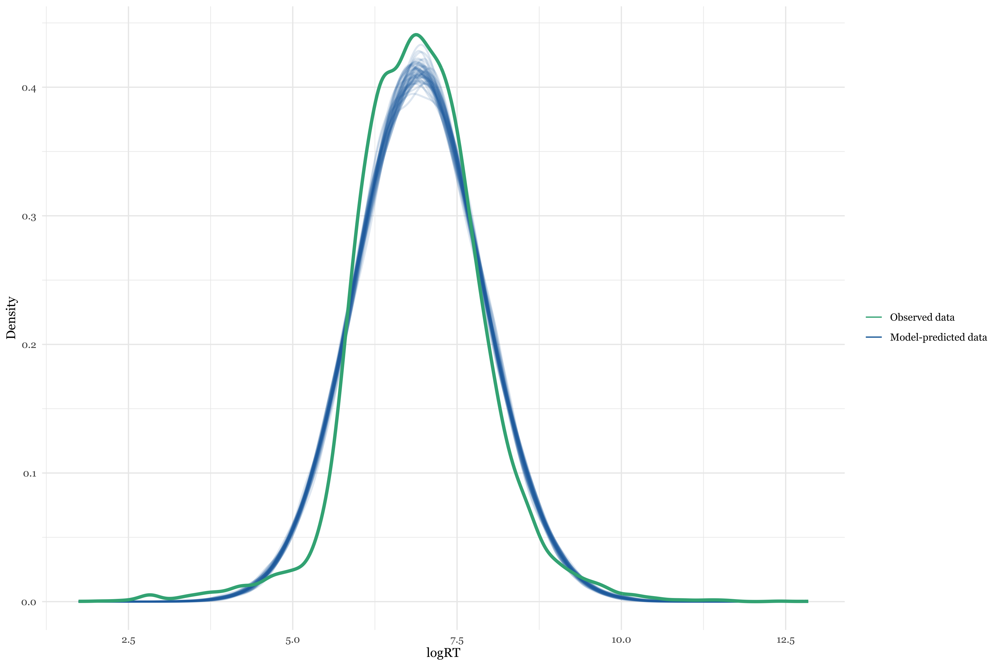
cat('<div style="color: black; font-size: 1em; margin-top: 0.25em;">
<span style="font-style: italic; ">Note.</span> Model-predicted intervals should include observed data points.
</div>')
cat('<br></br>')
```

This looks good - our model lines up well with the predicted model. Specifically, the observed data falls within the model-predicted intervals. This suggests that our model fits the assumptions of the underlying binomial distribution. 
#### Linearity (The logit of the probability is a linear function of the predictors.)

```{r linearity for RT,echo=FALSE, results='asis'}

# This plot helps assess whether the model’s mean structure is correctly specified. It shows whether the predicted probabilities systematically differ from the observed outcomes across the range of fitted values. If the model is appropriate, the binned residuals should cluster around zero with no clear pattern. Systematic curves or trends would suggest that the link function or the functional form of one or more predictors may be misspecified.
cat('<div class="apa-figure-title">   <span class="figure-label">Figure X.</span><br>
  Check of Linearity Assumption (Binned Residuals)
</div>
')
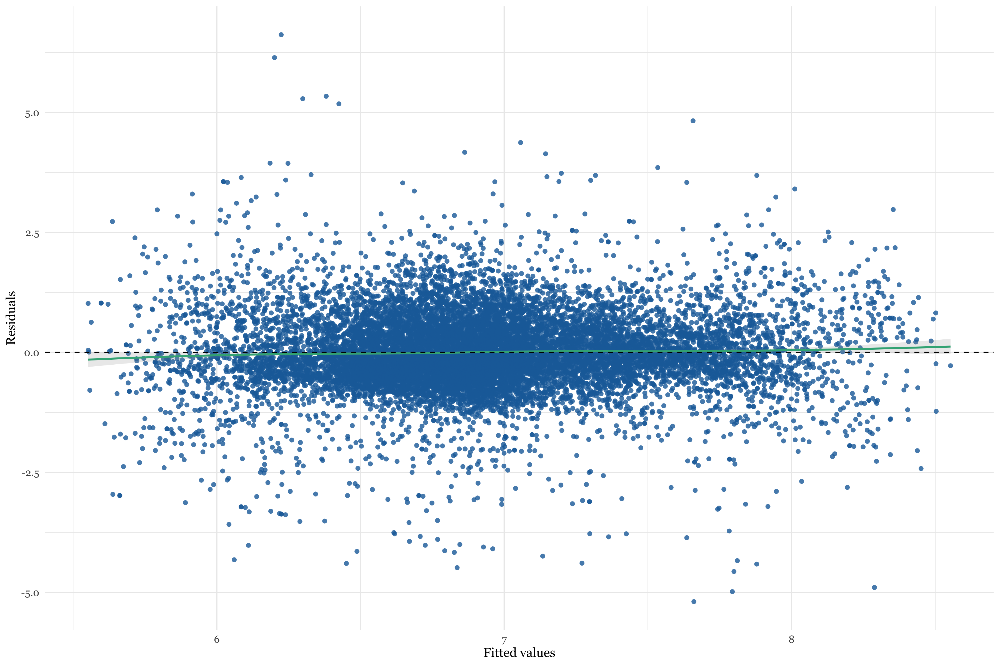
cat('<div style="color: black; font-size: 1em; margin-top: 0.25em;">
<span style="font-style: italic; ">Note.</span> Points should be within error bounds.
</div>')
cat('<br></br>')

```

This isn't quite what we'd want to confirm that the linearity assumption hasn't been violated. So, let's do some further checks. First, let's look at the relationship in more detail to see if we can detect a non-linear relationship (i.e. that the residuals do not follow linearity).

```{r plotting linearity of predicted response for RT, echo=FALSE, results='asis'}

cat('<div class="apa-figure-title">   <span class="figure-label">Figure X.</span><br>
  Checking the Residuals on the Plot of Predicted Probabilities of MJ
</div>
  ')
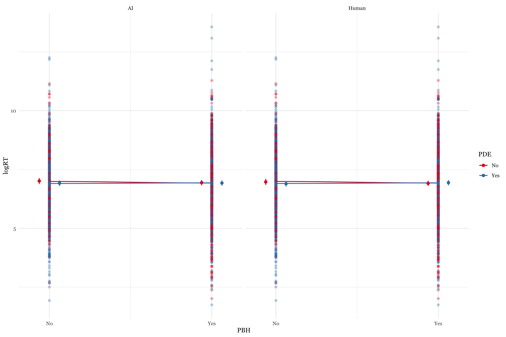
cat('<div style="color: black; font-size: 1em; margin-top: 0.25em;">
  <span style="font-style: italic; ">Note.</span> The dots are residuals and added lines are residual lines. 
</div>')
cat('<br></br>')
```

This looks pretty good. This, therefore, doesn't suggest a non-linear relationship. We've also already modelled all the interactions for the fixed factors. As a final check here, we can look at the effect of included the interactions for the random factor structure (though this threw a singularity issue, suggesting overfitting).

```{r plotting linearity of predicted response for RT model w. red data, eval=FALSE, results='asis'}
RT.pr <- predict_response(RT.hVai, terms = c("PBH [all]","PDE [all] ","Agent [all]"))
cat('<div class="apa-figure-title">   <span class="figure-label">Figure X.</span><br>
  Checking the Residuals on the Plot of Predicted Probabilities of MJ for the Model with RT RE Structure
</div>
  ')
plot(RT.pr, show_residuals = TRUE, show_residuals_line = TRUE,grid=TRUE) + georgia_theme + theme(title = element_blank())
cat('<div style="color: black; font-size: 1em; margin-top: 0.25em;">
  <span style="font-style: italic; ">Note.</span> The dots are residuals and added lines are residual lines. 
</div>')
cat('<br></br>')
```

Although this does fit the data a *little* better, it doesn't make that much difference overall. As such plots of linearity should be taken with caution anyway, this helps us be more confident that we don't have a "lack of fit" issue.

#### Dispersion

(Binomial equivalent to checking for dispersion) The posterior predictive check also helps us check for dispersion. We already did this when checking the model fit. 
We can also test with the nonparametric dispersion test from DHARMa.

```{r dispersion check for RT, echo=FALSE, results='asis'}
p <- testDispersion(hVai,plot=F) 
cat('**Written output of DHARMa nonparametric dispersion test via sd of residuals fitted vs. simulated :**', 
    '\n\n',
    'Dispersion:', p[["statistic"]],
    '\n\n',
    '*p*:', p[["p.value"]])
```
As we can see, this test of dispersion from the DHARMa package is non-significant, meaning there isn't any significant dispersion of our observed residuals to those of a normally distributed set of residuals. 
Together with our posterior predictive check analysis (and further steps taken as a result), we can rule out any concerns here. 

#### Outliers

```{r outliers for RT,echo=FALSE, results='asis'}

# This plot helps assess whether the model’s mean structure is correctly specified. It shows whether the predicted probabilities systematically differ from the observed outcomes across the range of fitted values. If the model is appropriate, the binned residuals should cluster around zero with no clear pattern. Systematic curves or trends would suggest that the link function or the functional form of one or more predictors may be misspecified.
cat('<div class="apa-figure-title">   <span class="figure-label">Figure X.</span><br>
  Check for Outliers (Influential Observations)
</div>
')
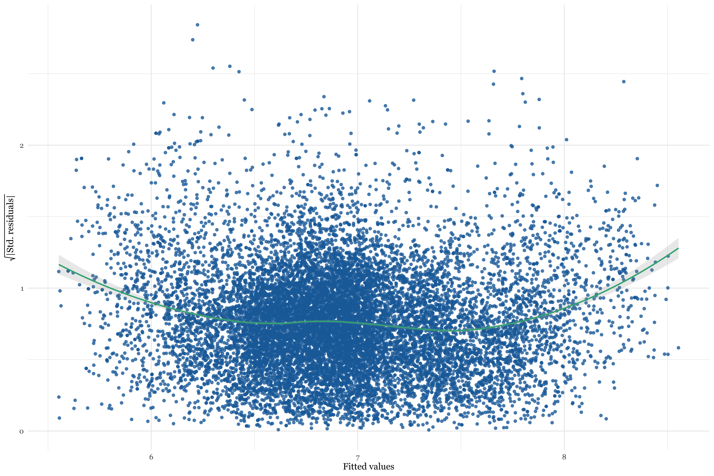
cat('<div style="color: black; font-size: 1em; margin-top: 0.25em;">
<span style="font-style: italic; ">Note.</span> Points should be inside the contour lines.
</div>')
cat('<br></br>')

```

Before checking these influential observations individually, we tested whether the residuals significantly deviate from the expected uniform distribution under the model.  
```{r simsResid outliers for RT, echo=FALSE,results='asis'}
simResid <- simulate_residuals(hVai)
out_obj <- performance::check_outliers(simResid)
cat('**Written output of outlier detection test:**', 
    '\n\n',
    'Proportion of observed outliers:', out_obj[["Coefficient"]],
    '\n\n',
    'Proportion of expected outliers:', out_obj[["Expected"]], '95% CI [', out_obj[["CI_low"]],',',out_obj[["CI_high"]],']',
    '\n\n',
    'No outliers were detected (*p*:', out_obj[["p_value"]],').')
```

As we can see, this does not flag any outliers, suggesting the highlighted cases in the Cook's distance plot, while influential, do not represent residual outliers.

#### Collinearity

```{r collinearity for RT,echo=FALSE, results='asis'}

# This plot helps assess whether the model’s mean structure is correctly specified. It shows whether the predicted probabilities systematically differ from the observed outcomes across the range of fitted values. If the model is appropriate, the binned residuals should cluster around zero with no clear pattern. Systematic curves or trends would suggest that the link function or the functional form of one or more predictors may be misspecified.
cat('<div class="apa-figure-title">   <span class="figure-label">Figure X.</span><br>
  Check for Collinearity
</div>
  ')
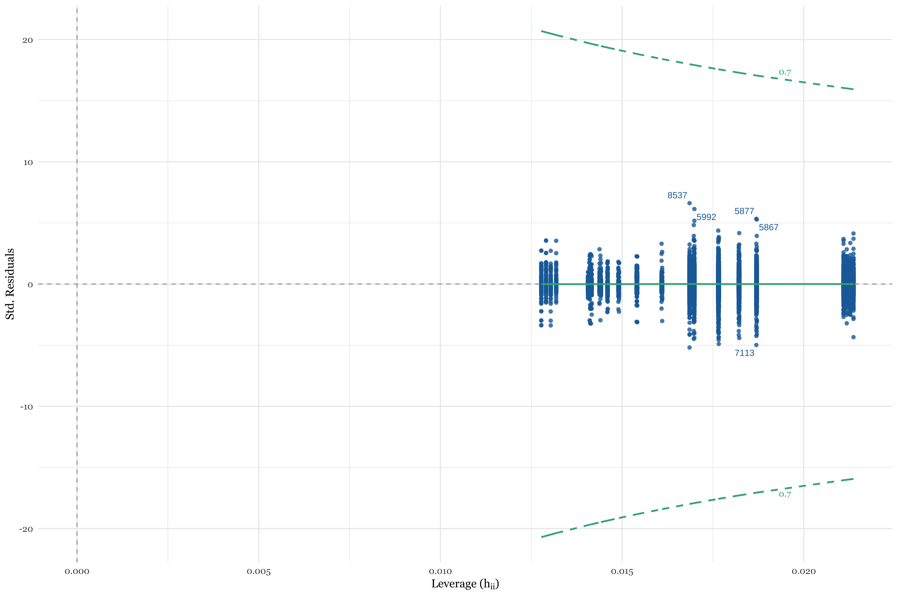
cat('<div style="color: black; font-size: 1em; margin-top: 0.25em;">
  <span style="font-style: italic; ">Note.</span> High collinearity variation inflation factor (VIF) may inflate parameter uncertainty.
</div>')
cat('<br></br>')

```

The VIF's for all parameters are low which means that each predictor does not correlate with the other predictors in such a way that might suggest that the value of all additional predictors/parameters added to the model is low. This would be consistent with our model comparison findings, where we see that the RTest model we can fit has the lowest AIC and BIC values than all other RT models. 

#### Normality of Residuals

```{r normality of resid for RT,echo=FALSE, results='asis'}

# This plot helps assess whether the model’s mean structure is correctly specified. It shows whether the predicted probabilities systematically differ from the observed outcomes across the range of fitted values. If the model is appropriate, the binned residuals should cluster around zero with no clear pattern. Systematic curves or trends would suggest that the link function or the functional form of one or more predictors may be misspecified.
cat('<div class="apa-figure-title">   <span class="figure-label">Figure X.</span><br>
  Checking for Uniformity of Residuals (QQ Plot) 
</div>
')
knitr::include_graphics("figures/Study2_RT_diagnostic_5.png")
cat('<div style="color: black; font-size: 1em; margin-top: 0.25em;">
<span style="font-style: italic; ">Note.</span> Points should be inside the contour lines.
</div>')
cat('<br></br>')

```
Our residuals show a good fit with the standard quantiles of a normal uniform distribution. 

#### Normality of Random Effects

##### Participants

```{r RE normality for RT,echo=FALSE, results='asis'}

# Display the first plot
# Uniformity of Residuals
# Dots should fall along the lines
cat('<div class="apa-figure-title">   <span class="figure-label">Figure X.</span><br>
  Checking for Normality of Participants Random Effect 
</div>
')
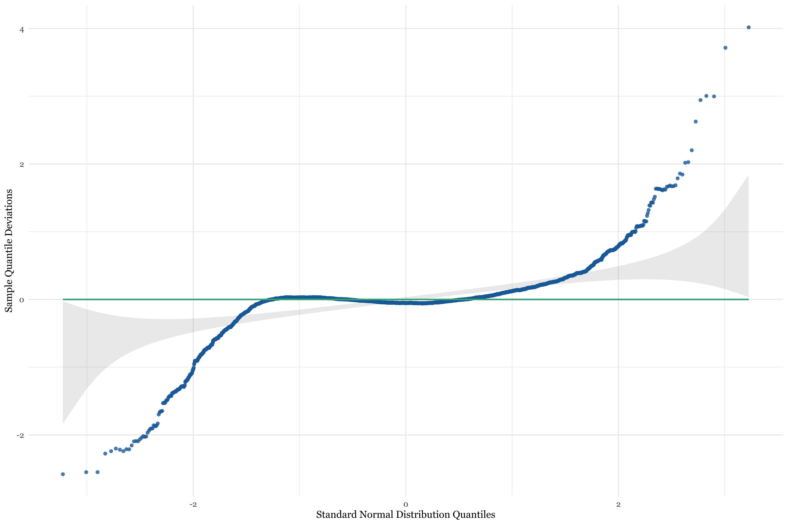
cat('<div style="color: black; font-size: 1em; margin-top: 0.25em;">
<span style="font-style: italic; ">Note.</span> Dot should be plotted along the line.
</div>')
cat('<br></br>')
```

##### Dilemmas

```{r dilemma RE normality for RT,echo=FALSE, results='asis'}

cat('<div class="apa-figure-title">   <span class="figure-label">Figure X.</span><br>
  Checking for Normality of Dilemmas Random Effect 
</div>
')
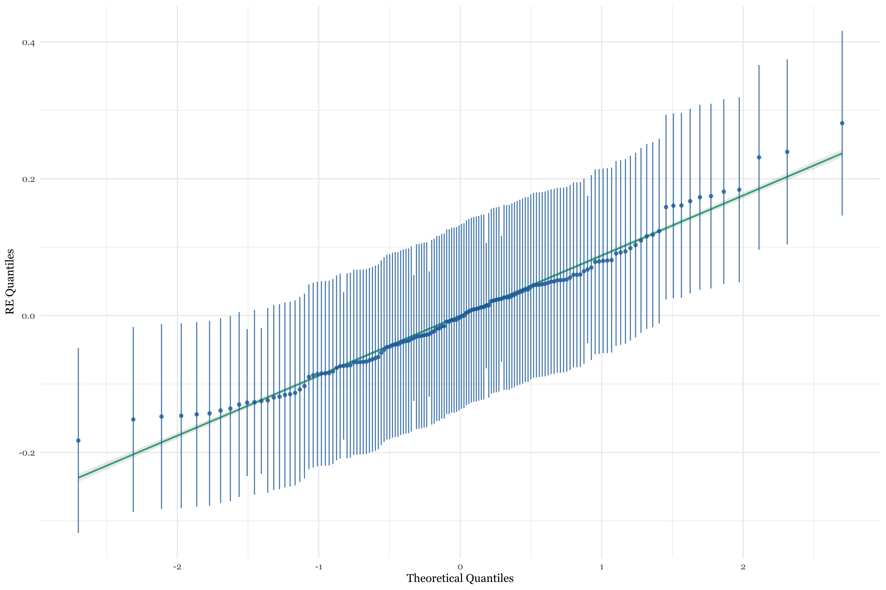
cat('<div style="color: black; font-size: 1em; margin-top: 0.25em;">
<span style="font-style: italic; ">Note.</span> Dot should be plotted along the line.
</div>')
cat('<br></br>')

```

Both of our random factors look good and fit the assumptions of a normal distribution. 

## Modelling RT (log-transformed) as RE
First, the GLMM model was fit with a RTRE random effects structure.

```{r RTRE model w. RTRE RE structure, eval=FALSE,echo=TRUE}
full.hVai <- glmer(MJ ~ PBH*PDE*Agent +  (1+PBH*PDE*Agent*logRT|ID) + (1+Agent|dilemma),  data=df, family = binomial(link = "logit"),
                      control = glmerControl(optCtrl = list(maxfun = 2e5), optimizer = "bobyqa"))
```

```{r read in RTRE model, echo=FALSE}
set.platform("outputs")
hVai <- readRDS("dropAgentIDdilRE_hVai_RTRE_glmModel.rds")
```

This returned a singularity issue. Therefore, the complexity of the random effects structure was RTRE (by order of importance) until no singularity warning was returned. The model below was the final fitted model.

```{r RTRE model w. simplified RE structure, eval=FALSE,echo=TRUE}
hVai <- glmer(MJ ~ PBH*PDE*Agent +  (1+PBH+PDE+logRT|ID) + (1|Dilemma),  data=df, family = binomial(link = "logit"),
              control = glmerControl(optCtrl = list(maxfun = 2e5), optimizer = "bobyqa"))

#OR coefficients 
OR_hVai <- exp(fixef(hVai))
#CIs
ci_hVai <- confint(hVai, method = "Wald")
ci_hVai.or <- exp(ci_hVai)
ses_hVai <- sqrt(diag(vcov(hVai)))
```

```{r RTRE model w. RTRE RE structure from saved, echo=FALSE}
set.platform("outputs")
hVai <- readRDS("dropAgentIDdilRE_hVai_RTRE_glmModel.rds")
#OR coefficients 
OR_hVai <- exp(fixef(hVai))
# confidence intervals for log-odds and OR
ci_hVai <- confint(hVai, method = "Wald") 
ci_hVai.or <- exp(ci_hVai)
ses_hVai <- sqrt(diag(vcov(hVai)))
```

```{r summary RTRE,results='asis',echo=FALSE,cache=FALSE}

cat('
<div class="apa-table-title">
  <span class="table-label">Table 2.</span> Logistic GLMM Human v AI MJs explained by MG (OR)
</div>')
# OR table
tmp <- URLencode(paste(readLines("tables/Study2_RTRE_regression_OR.html"), collapse="\n"))

cat('<iframe src="data:text/html;charset=utf-8,', tmp ,
    '" style="border: none; seamless:seamless; width: 800px; height: 200px"></iframe>')
cat('</td>')
cat('<td style="vertical-align:top; width:100%; padding:4px;">')
cat('<table style="width:100%; table-layout:fixed;"><tr>')
cat('<td style="vertical-align:top; width:100%; padding:10px;">')
cat('
<div class="apa-table-title">
  <span class="table-label">Table 1.</span> Logistic GLMM Human v AI MJs explained by MG (Log Odds)
</div>')
# log-odds table
tmp <- URLencode(paste(readLines("tables/Study2_RTRE_regression_logodds.html"), collapse="\n"))

cat('<iframe src="data:text/html;charset=utf-8,', tmp ,
    '" style="border: none; seamless:seamless; width: 800px; height: 200px"></iframe>')
cat('</td></tr></table>')

```

```{r hVai RTRE report,eval=FALSE}
hVai_report <- report(hVai)   
hVai_report
```


```{r plot models for RTRE, echo=FALSE, results='asis',out.width="80%"}

# combine rows
cat(' <div class="apa-figure-title">   <span class="figure-label">Figure 1.</span><br>
  Predicted probabilities for PBH
</div>
')
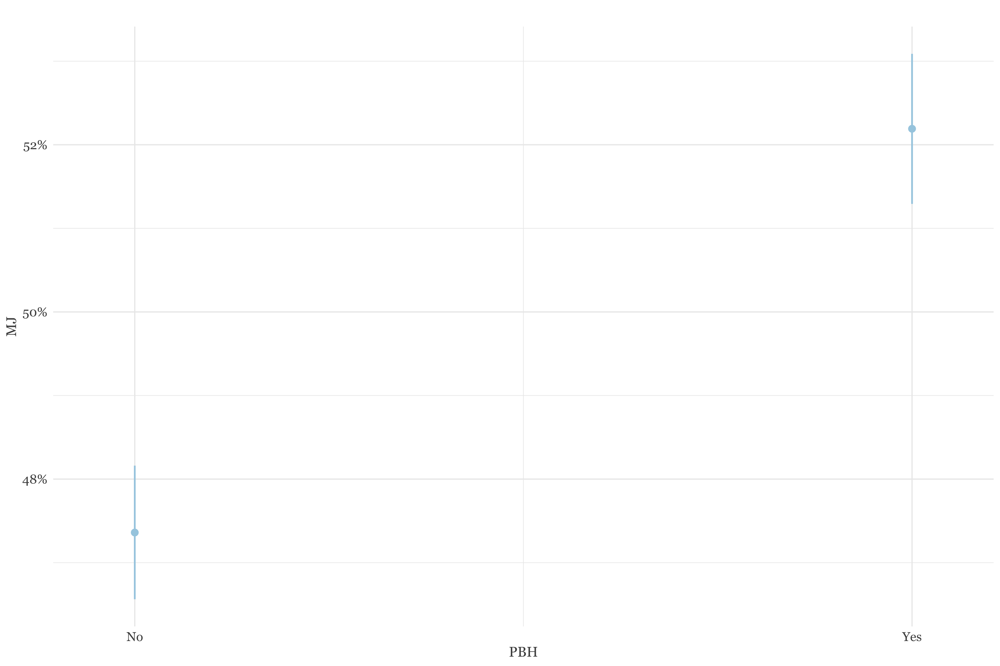
cat('<br></br>')
cat(' <div class="apa-figure-title">   <span class="figure-label">Figure 2.</span><br>
  Predicted probabilities for PDE
</div>
')
knitr::include_graphics("figures/Study2_RTRE_pred_PDE.png")
cat('<br></br>')
cat(' <div class="apa-figure-title">   <span class="figure-label">Figure 3.</span><br>
  Predicted probabilities for Agent
</div>
')
knitr::include_graphics("figures/Study2_RTRE_pred_Agent.png")
cat('<br></br>')
```

```{r interaction plots for RTRE, echo=FALSE,results='asis'}

############################################################
# 2. INTERACTION PLOTS
############################################################

cat(' <div class="apa-figure-title">   <span class="figure-label">Figure 4.</span><br>
  Predicted probabilities for PBH x PDE
</div>
')
knitr::include_graphics("figures/Study2_RTRE_interaction_PBH_PDE.png")
cat('<br></br>')
cat(' <div class="apa-figure-title">   <span class="figure-label">Figure 5.</span><br>
  Predicted probabilities for PBH x Agent
</div>
')
knitr::include_graphics("figures/Study2_RTRE_interaction_PBH_Agent.png")
cat('<br></br>')
cat(' <div class="apa-figure-title">   <span class="figure-label">Figure 6.</span><br>
  Predicted probabilities for PDE x Agent
</div>
')
knitr::include_graphics("figures/Study2_RTRE_interaction_PDE_Agent.png")
cat('<br></br>')
cat(' <div class="apa-figure-title">   <span class="figure-label">Figure 7.</span><br>
  Predicted probabilities for PBH x PDE x Agent
</div>
')
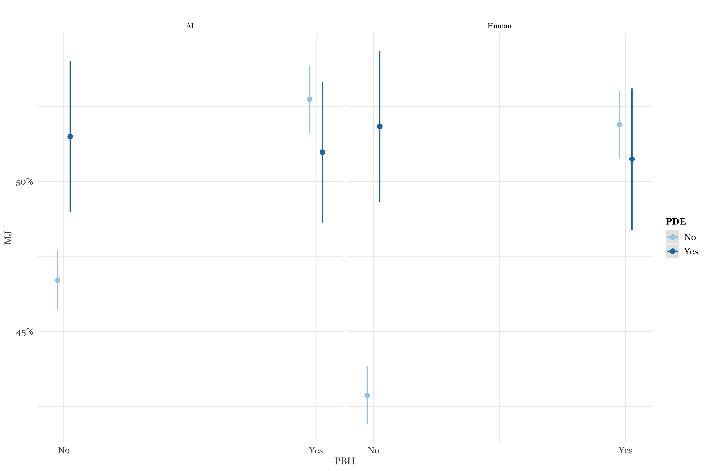
cat('<br></br>')

```

### Estimated Marginal Means of Main Analysis (by factor)

```{r EMMs for RTRE, echo=FALSE,warning=FALSE,results='asis'}
set.platform("tables")
cat('
<div class="apa-table-title">
  <span class="table-label">Table 3.</span> Estimated marginal means by PBH × PDE within Agent
</div>')
includeHTML("Study2_RTRE_EMM_Agent.html")
cat('<br></br>')
cat('
<div class="apa-table-title">
  <span class="table-label">Table 4.</span> Estimated marginal means by PDE x Agent within PBH
</div>')
includeHTML("Study2_RTRE_EMM_PBH.html")

cat('<br></br>')
cat('
<div class="apa-table-title">
  <span class="table-label">Table 5.</span> Estimated marginal means by Agent × PDE within PDE
</div>')
includeHTML("Study2_RTRE_EMM_PDE.html")
cat('<br></br>')

cat('<br></br>')
cat('
<div class="apa-table-title">
  <span class="table-label">Table 4.</span> Estimated marginal means of PDE within PBH
</div>')
includeHTML("Study2_RTRE_EMM_PBH.html")
cat('<br></br>')
```

#### Contrasts of EMMs

```{r contrasts for RTRE, echo=FALSE, results='asis'}
set.platform("tables")
cat('
<div class="apa-table-title">
  <span class="table-label">Table 6.</span> Pairwise contrasts for PBH × PDE within Agent
</div>')
includeHTML("Study2_RTRE_contrast_Agent.html")

cat('<br></br>')
cat('
<div class="apa-table-title">
  <span class="table-label">Table 7.</span> Pairwise contrasts for PBH × Agent within PBH
</div>')
includeHTML("Study2_RTRE_contrast_PBH.html")


cat('<br></br>')
cat('
<div class="apa-table-title">
  <span class="table-label">Table 8.</span> Pairwise contrasts for PDE × Agent within PDE
</div>')
includeHTML("Study2_RTRE_contrast_PDE.html")
cat('<br></br>')

```

### Two Sided Equivalence Test for Main Analysis

```{r toast w. what actually had power for, for RTRE, echo=FALSE, results='asis'}

cat('<br></br>')
cat('
<div class="apa-table-title">
  <span class="table-label">Table 10.</span> TOST-test for Practical Equivalence for Main Model
</div>')
includeHTML("tables/Study2_RTRE_TOST_table.html")
cat('<br></br>')
set.platform()
cat('<br></br>')
cat(' <div class="apa-figure-title">   <span class="figure-label">Figure 9.</span><br>
  TOST results for Main Analysis 
</div>
')
knitr::include_graphics("figures/Study2_RTRE_TOST_plot.png")
cat('<div style="color: black; font-size: 1em; margin-top: 0.25em;">
<span style="font-style: italic; ">Note.</span> Bounds set to mid-point value of small effect size boundary for log odds (±0.94). This is what the study was actually powered to detect for a three-way interaction. 
</div>')
cat('<br></br>')

```


### Model Comparisons


```{r model comp for RTRE, eval=FALSE}
model_comp <- compare_performance(Agent, PBH, PDE, PBH_Agent, PDE_Agent, PBH_PDE, hVai)
```

```{r model comp from saved for RTRE, echo=FALSE, results='asis'}
set.platform("tables")
cat('<br></br>')
cat('
<div class="apa-table-title">
  <span class="table-label">Table 17.</span> Comparison of logistic GLMMs with alternative fixed-factor combinations predicting moral judgments (with RE structure as in final model)
</div>')
includeHTML(("Study2_RTRE_model_comparison.html"))
cat('<div style="color: black; font-size: 1em; margin-top: 0.25em;">
<span style="font-style: italic; ">Note.</span> Lower AIC and BIC indicate better fit.
</div>')
cat('<br></br>')

```


### Model Checks

#### Check Model Fit to Distribution

```{r model checks for RTRE, echo=FALSE, results='asis'}

cat('<div class="apa-figure-title">   <span class="figure-label">Figure X.</span><br>
  Posterior Predictive Check
</div>
')

cat('<div style="color: black; font-size: 1em; margin-top: 0.25em;">
<span style="font-style: italic; ">Note.</span> Model-predicted intervals should include observed data points.
</div>')
cat('<br></br>')
```

This looks good - our model lines up well with the predicted model. Specifically, the observed data falls within the model-predicted intervals. This suggests that our model fits the assumptions of the underlying binomial distribution. 
#### Linearity (The logit of the probability is a linear function of the predictors.)

```{r linearity for RTRE,echo=FALSE, results='asis'}

# This plot helps assess whether the model’s mean structure is correctly specified. It shows whether the predicted probabilities systematically differ from the observed outcomes across the range of fitted values. If the model is appropriate, the binned residuals should cluster around zero with no clear pattern. Systematic curves or trends would suggest that the link function or the functional form of one or more predictors may be misspecified.
cat('<div class="apa-figure-title">   <span class="figure-label">Figure X.</span><br>
  Check of Linearity Assumption (Binned Residuals)
</div>
')
knitr::include_graphics("figures/Study2_RTRE_diagnostic_2.png")
cat('<div style="color: black; font-size: 1em; margin-top: 0.25em;">
<span style="font-style: italic; ">Note.</span> Points should be within error bounds.
</div>')
cat('<br></br>')

```

This isn't quite what we'd want to confirm that the linearity assumption hasn't been violated. So, let's do some further checks. First, let's look at the relationship in more detail to see if we can detect a non-linear relationship (i.e. that the residuals do not follow linearity).

```{r plotting linearity of predicted response for RTRE, echo=FALSE, results='asis'}

cat('<div class="apa-figure-title">   <span class="figure-label">Figure X.</span><br>
  Checking the Residuals on the Plot of Predicted Probabilities of MJ
</div>
  ')
knitr::include_graphics("figures/Study2_RTRE_diagnostic_pred_response.png")
cat('<div style="color: black; font-size: 1em; margin-top: 0.25em;">
  <span style="font-style: italic; ">Note.</span> The dots are residuals and added lines are residual lines. 
</div>')
cat('<br></br>')
```

This looks pretty good. This, therefore, doesn't suggest a non-linear relationship. We've also already modelled all the interactions for the fixed factors. As a final check here, we can look at the effect of included the interactions for the random factor structure (though this threw a singularity issue, suggesting overfitting).

```{r plotting linearity of predicted response for RTRE model w. red data, eval=FALSE, results='asis'}
RTRE.pr <- predict_response(RTRE.hVai, terms = c("PBH [all]","PDE [all] ","Agent [all]"))
cat('<div class="apa-figure-title">   <span class="figure-label">Figure X.</span><br>
  Checking the Residuals on the Plot of Predicted Probabilities of MJ for the Model with RTRE RE Structure
</div>
  ')
plot(RTRE.pr, show_residuals = TRUE, show_residuals_line = TRUE,grid=TRUE) + georgia_theme + theme(title = element_blank())
cat('<div style="color: black; font-size: 1em; margin-top: 0.25em;">
  <span style="font-style: italic; ">Note.</span> The dots are residuals and added lines are residual lines. 
</div>')
cat('<br></br>')
```

Although this does fit the data a *little* better, it doesn't make that much difference overall. As such plots of linearity should be taken with caution anyway, this helps us be more confident that we don't have a "lack of fit" issue.

#### Dispersion

(Binomial equivalent to checking for dispersion) The posterior predictive check also helps us check for dispersion. We already did this when checking the model fit. 
We can also test with the nonparametric dispersion test from DHARMa.

```{r dispersion check for RTRE, echo=FALSE, results='asis'}
p <- testDispersion(hVai,plot=F) 
cat('**Written output of DHARMa nonparametric dispersion test via sd of residuals fitted vs. simulated :**', 
    '\n\n',
    'Dispersion:', p[["statistic"]],
    '\n\n',
    '*p*:', p[["p.value"]])
```
As we can see, this test of dispersion from the DHARMa package is non-significant, meaning there isn't any significant dispersion of our observed residuals to those of a normally distributed set of residuals. 
Together with our posterior predictive check analysis (and further steps taken as a result), we can rule out any concerns here. 

#### Outliers

```{r outliers for RTRE,echo=FALSE, results='asis'}

# This plot helps assess whether the model’s mean structure is correctly specified. It shows whether the predicted probabilities systematically differ from the observed outcomes across the range of fitted values. If the model is appropriate, the binned residuals should cluster around zero with no clear pattern. Systematic curves or trends would suggest that the link function or the functional form of one or more predictors may be misspecified.
cat('<div class="apa-figure-title">   <span class="figure-label">Figure X.</span><br>
  Check for Outliers (Influential Observations)
</div>
')
knitr::include_graphics("figures/Study2_RTRE_diagnostic_3.png")
cat('<div style="color: black; font-size: 1em; margin-top: 0.25em;">
<span style="font-style: italic; ">Note.</span> Points should be inside the contour lines.
</div>')
cat('<br></br>')

```

Before checking these influential observations individually, we tested whether the residuals significantly deviate from the expected uniform distribution under the model.  
```{r simsResid outliers for RTRE, echo=FALSE,results='asis'}
simResid <- simulate_residuals(hVai)
out_obj <- performance::check_outliers(simResid)
cat('**Written output of outlier detection test:**', 
    '\n\n',
    'Proportion of observed outliers:', out_obj[["Coefficient"]],
    '\n\n',
    'Proportion of expected outliers:', out_obj[["Expected"]], '95% CI [', out_obj[["CI_low"]],',',out_obj[["CI_high"]],']',
    '\n\n',
    'No outliers were detected (*p*:', out_obj[["p_value"]],').')
```

As we can see, this does not flag any outliers, suggesting the highlighted cases in the Cook's distance plot, while influential, do not represent residual outliers.

#### Collinearity

```{r collinearity for RTRE,echo=FALSE, results='asis'}

# This plot helps assess whether the model’s mean structure is correctly specified. It shows whether the predicted probabilities systematically differ from the observed outcomes across the range of fitted values. If the model is appropriate, the binned residuals should cluster around zero with no clear pattern. Systematic curves or trends would suggest that the link function or the functional form of one or more predictors may be misspecified.
cat('<div class="apa-figure-title">   <span class="figure-label">Figure X.</span><br>
  Check for Collinearity
</div>
  ')
knitr::include_graphics("figures/Study2_RTRE_diagnostic_4.png")
cat('<div style="color: black; font-size: 1em; margin-top: 0.25em;">
  <span style="font-style: italic; ">Note.</span> High collinearity variation inflation factor (VIF) may inflate parameter uncertainty.
</div>')
cat('<br></br>')

```

The VIF's for all parameters are low which means that each predictor does not correlate with the other predictors in such a way that might suggest that the value of all additional predictors/parameters added to the model is low. This would be consistent with our model comparison findings, where we see that the RTREest model we can fit has the lowest AIC and BIC values than all other RTRE models. 

#### Normality of Residuals

```{r normality of resid for RTRE,echo=FALSE, results='asis'}

# This plot helps assess whether the model’s mean structure is correctly specified. It shows whether the predicted probabilities systematically differ from the observed outcomes across the range of fitted values. If the model is appropriate, the binned residuals should cluster around zero with no clear pattern. Systematic curves or trends would suggest that the link function or the functional form of one or more predictors may be misspecified.
cat('<div class="apa-figure-title">   <span class="figure-label">Figure X.</span><br>
  Checking for Uniformity of Residuals (QQ Plot) 
</div>
')
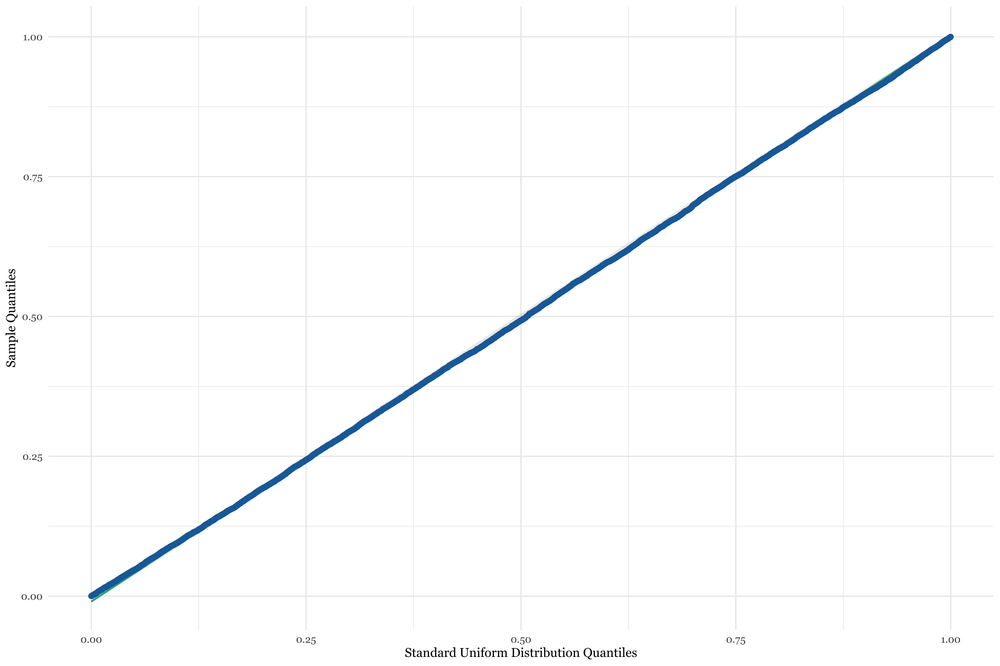
cat('<div style="color: black; font-size: 1em; margin-top: 0.25em;">
<span style="font-style: italic; ">Note.</span> Points should be inside the contour lines.
</div>')
cat('<br></br>')

```
Our residuals show a good fit with the standard quantiles of a normal uniform distribution. 

#### Normality of Random Effects

##### Participants

```{r RE normality for RTRE,echo=FALSE, results='asis'}

# Display the first plot
# Uniformity of Residuals
# Dots should fall along the lines
cat('<div class="apa-figure-title">   <span class="figure-label">Figure X.</span><br>
  Checking for Normality of Participants Random Effect 
</div>
')
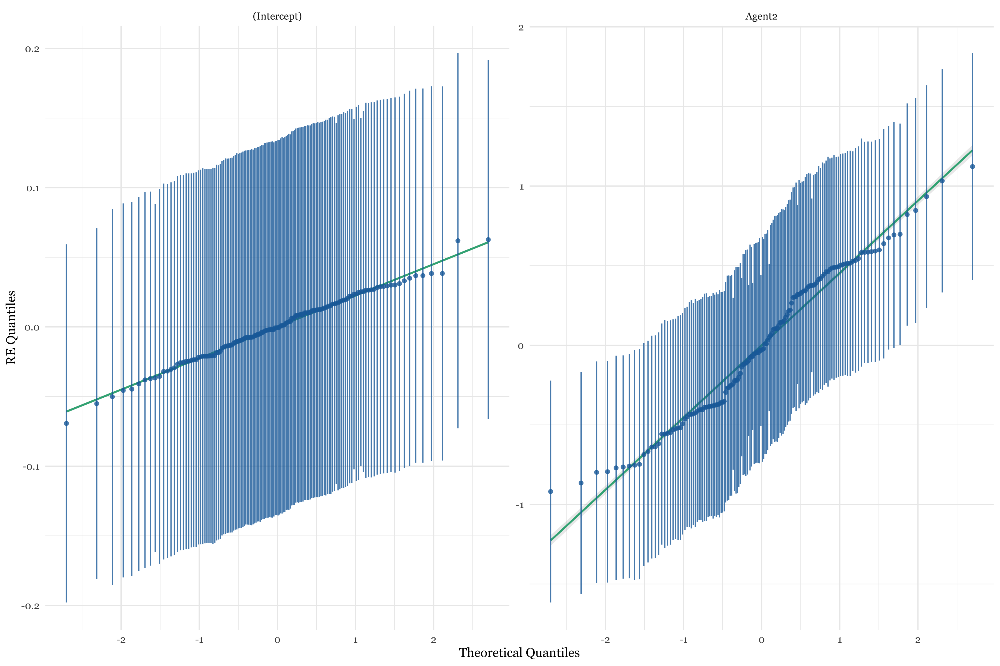
cat('<div style="color: black; font-size: 1em; margin-top: 0.25em;">
<span style="font-style: italic; ">Note.</span> Dot should be plotted along the line.
</div>')
cat('<br></br>')
```

##### Dilemmas

```{r dilemma RE normality for RTRE,echo=FALSE, results='asis'}

cat('<div class="apa-figure-title">   <span class="figure-label">Figure X.</span><br>
  Checking for Normality of Dilemmas Random Effect 
</div>
')
knitr::include_graphics("figures/Study2_RTRE_diagnostic_7.png")
cat('<div style="color: black; font-size: 1em; margin-top: 0.25em;">
<span style="font-style: italic; ">Note.</span> Dot should be plotted along the line.
</div>')
cat('<br></br>')

```

Both of our random factors look good and fit the assumptions of a normal distribution. 

-->

## Removing Participants who failed a costless rescue Human scenario
First, the GLMM model was fit with a match random effects structure.

```{r match model w. match RE structure, eval=FALSE,echo=TRUE}
full.hVai <- glmer(MJ ~ PBH*PDE*Agent +  (1+PBH*PDE*Agent|ID) + (1+Agent|dilemma),  data=df_match, family = binomial(link = "logit"),
                      control = glmerControl(optCtrl = list(maxfun = 2e5), optimizer = "bobyqa"))
```

```{r read in match model, echo=FALSE}
set.platform("outputs")
hVai <- readRDS("dropAgentIDdilRE_hVai_match_glmModel.rds")
```

This returned a singularity issue. Therefore, the complexity of the random effects structure was match (by order of importance) until no singularity warning was returned. The model below was the final fitted model.

```{r match model w. simplified RE structure, eval=FALSE,echo=TRUE}
hVai <- glmer(MJ ~ PBH*PDE*Agent +  (1+PBH+PDE|ID) + (1|Dilemma),  data=df_match, family = binomial(link = "logit"),
              control = glmerControl(optCtrl = list(maxfun = 2e5), optimizer = "bobyqa"))

#OR coefficients 
OR_hVai <- exp(fixef(hVai))
#CIs
ci_hVai <- confint(hVai, method = "Wald")
ci_hVai.or <- exp(ci_hVai)
ses_hVai <- sqrt(diag(vcov(hVai)))
```

```{r match model w. match RE structure from saved, echo=FALSE}
set.platform("outputs")
hVai <- readRDS("dropAgentIDdilRE_hVai_match_glmModel.rds")
#OR coefficients 
OR_hVai <- exp(fixef(hVai))
# confidence intervals for log-odds and OR
ci_hVai <- confint(hVai, method = "Wald") 
ci_hVai.or <- exp(ci_hVai)
ses_hVai <- sqrt(diag(vcov(hVai)))
```

```{r summary match,results='asis',echo=FALSE,cache=FALSE}

cat('
<div class="apa-table-title">
  <span class="table-label">Table 2.</span> Logistic GLMM Human v AI MJs explained by MG (OR)
</div>')
# OR table
tmp <- URLencode(paste(readLines("tables/Study2_match_regression_OR.html"), collapse="\n"))

cat('<iframe src="data:text/html;charset=utf-8,', tmp ,
    '" style="border: none; seamless:seamless; width: 800px; height: 200px"></iframe>')
cat('</td>')
cat('<td style="vertical-align:top; width:100%; padding:4px;">')
cat('<table style="width:100%; table-layout:fixed;"><tr>')
cat('<td style="vertical-align:top; width:100%; padding:10px;">')
cat('
<div class="apa-table-title">
  <span class="table-label">Table 1.</span> Logistic GLMM Human v AI MJs explained by MG (Log Odds)
</div>')
# log-odds table
tmp <- URLencode(paste(readLines("tables/Study2_match_regression_logodds.html"), collapse="\n"))

cat('<iframe src="data:text/html;charset=utf-8,', tmp ,
    '" style="border: none; seamless:seamless; width: 800px; height: 200px"></iframe>')
cat('</td></tr></table>')

```

```{r hVai match report,eval=FALSE}
hVai_report <- report(hVai)   
hVai_report
```


```{r plot models for match, echo=FALSE, results='asis',out.width="80%"}

# combine rows
cat(' <div class="apa-figure-title">   <span class="figure-label">Figure 1.</span><br>
  Predicted probabilities for PBH
</div>
')
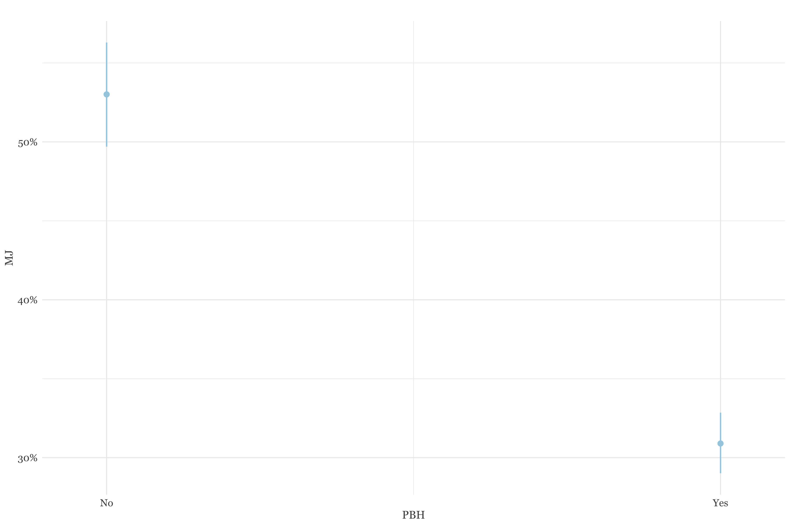
cat('<br></br>')
cat(' <div class="apa-figure-title">   <span class="figure-label">Figure 2.</span><br>
  Predicted probabilities for PDE
</div>
')
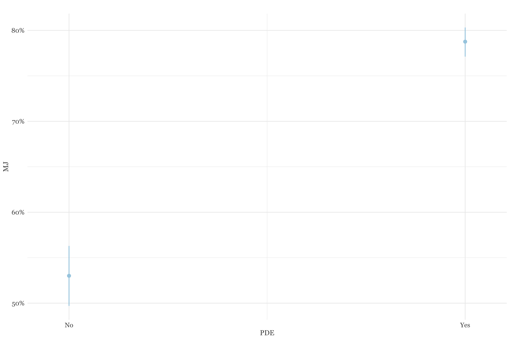
cat('<br></br>')
cat(' <div class="apa-figure-title">   <span class="figure-label">Figure 3.</span><br>
  Predicted probabilities for Agent
</div>
')
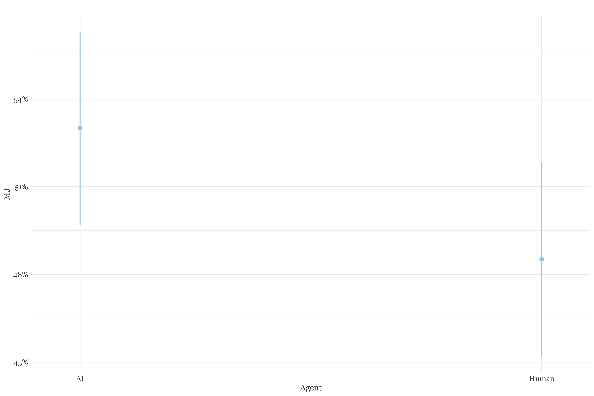
cat('<br></br>')
```

```{r interaction plots for match, echo=FALSE,results='asis'}

############################################################
# 2. INTERACTION PLOTS
############################################################

cat(' <div class="apa-figure-title">   <span class="figure-label">Figure 4.</span><br>
  Predicted probabilities for PBH x PDE
</div>
')
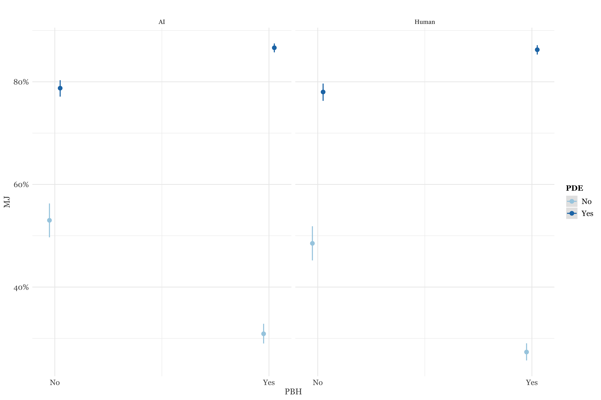
cat('<br></br>')
cat(' <div class="apa-figure-title">   <span class="figure-label">Figure 5.</span><br>
  Predicted probabilities for PBH x Agent
</div>
')
knitr::include_graphics("figures/Study2_match_interaction_PBH_Agent.png")
cat('<br></br>')
cat(' <div class="apa-figure-title">   <span class="figure-label">Figure 6.</span><br>
  Predicted probabilities for PDE x Agent
</div>
')
knitr::include_graphics("figures/Study2_match_interaction_PDE_Agent.png")
cat('<br></br>')
cat(' <div class="apa-figure-title">   <span class="figure-label">Figure 7.</span><br>
  Predicted probabilities for PBH x PDE x Agent
</div>
')
knitr::include_graphics("figures/Study2_match_interaction_plot.png")
cat('<br></br>')

```

### Estimated Marginal Means of Main Analysis (by factor)

```{r EMMs for match, echo=FALSE,warning=FALSE,results='asis'}
set.platform("tables")
cat('
<div class="apa-table-title">
  <span class="table-label">Table 3.</span> Estimated marginal means by PBH × PDE within Agent
</div>')
includeHTML("Study2_match_EMM_Agent.html")
cat('<br></br>')
cat('
<div class="apa-table-title">
  <span class="table-label">Table 4.</span> Estimated marginal means by PDE x Agent within PBH
</div>')
includeHTML("Study2_match_EMM_PBH.html")

cat('<br></br>')
cat('
<div class="apa-table-title">
  <span class="table-label">Table 5.</span> Estimated marginal means by Agent × PDE within PDE
</div>')
includeHTML("Study2_match_EMM_PDE.html")
cat('<br></br>')

cat('<br></br>')
cat('
<div class="apa-table-title">
  <span class="table-label">Table 4.</span> Estimated marginal means of PDE within PBH
</div>')
includeHTML("Study2_match_EMM_PBH.html")
cat('<br></br>')
```

#### Contrasts of EMMs

```{r contrasts for match, echo=FALSE, results='asis'}
set.platform("tables")
cat('
<div class="apa-table-title">
  <span class="table-label">Table 6.</span> Pairwise contrasts for PBH × PDE within Agent
</div>')
includeHTML("Study2_match_contrast_Agent.html")

cat('<br></br>')
cat('
<div class="apa-table-title">
  <span class="table-label">Table 7.</span> Pairwise contrasts for PBH × Agent within PBH
</div>')
includeHTML("Study2_match_contrast_PBH.html")


cat('<br></br>')
cat('
<div class="apa-table-title">
  <span class="table-label">Table 8.</span> Pairwise contrasts for PDE × Agent within PDE
</div>')
includeHTML("Study2_match_contrast_PDE.html")
cat('<br></br>')

```

### Two Sided Equivalence Test for Main Analysis

```{r toast w. what actually had power for, for match, echo=FALSE, results='asis'}

cat('<br></br>')
cat('
<div class="apa-table-title">
  <span class="table-label">Table 10.</span> TOST-test for Practical Equivalence for Main Model
</div>')
includeHTML("tables/Study2_match_TOST_table.html")
cat('<br></br>')
set.platform()
cat('<br></br>')
cat(' <div class="apa-figure-title">   <span class="figure-label">Figure 9.</span><br>
  TOST results for Main Analysis 
</div>
')
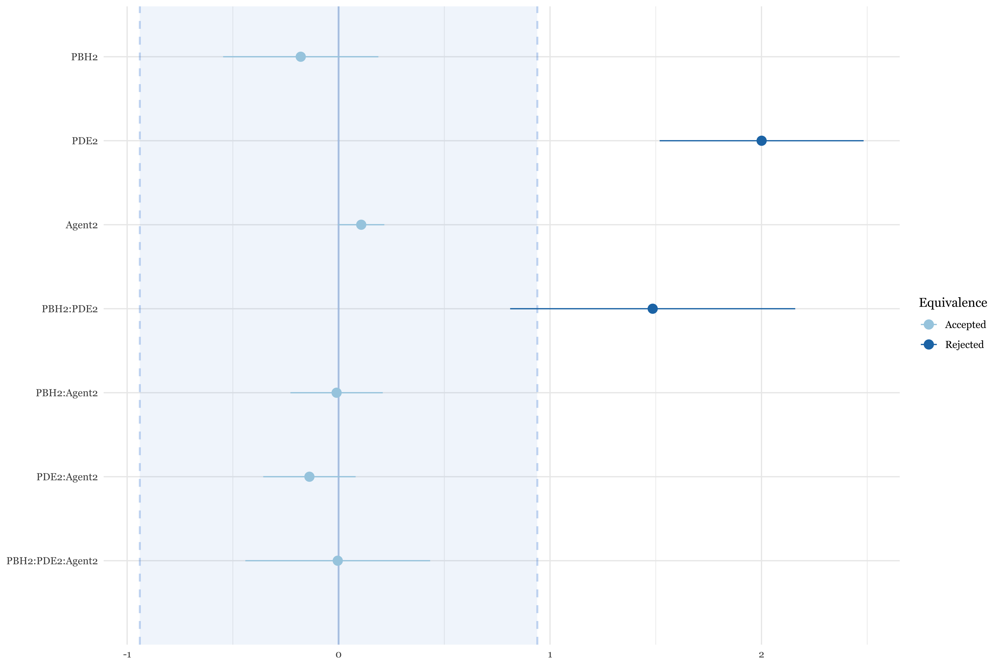
cat('<div style="color: black; font-size: 1em; margin-top: 0.25em;">
<span style="font-style: italic; ">Note.</span> Bounds set to mid-point value of small effect size boundary for log odds (±0.94). This is what the study was actually powered to detect for a three-way interaction. 
</div>')
cat('<br></br>')

```


### Model Comparisons


```{r model comp for match, eval=FALSE}
model_comp <- compare_performance(Agent, PBH, PDE, PBH_Agent, PDE_Agent, PBH_PDE, hVai)
```

```{r model comp from saved for match, echo=FALSE, results='asis'}
set.platform("tables")
cat('<br></br>')
cat('
<div class="apa-table-title">
  <span class="table-label">Table 17.</span> Comparison of logistic GLMMs with alternative fixed-factor combinations predicting moral judgments (with RE structure as in final model)
</div>')
includeHTML(("Study2_match_model_comparison.html"))
cat('<div style="color: black; font-size: 1em; margin-top: 0.25em;">
<span style="font-style: italic; ">Note.</span> Lower AIC and BIC indicate better fit.
</div>')
cat('<br></br>')

```


### Model Checks

#### Check Model Fit to Distribution

```{r model checks for match, echo=FALSE, results='asis'}

cat('<div class="apa-figure-title">   <span class="figure-label">Figure X.</span><br>
  Posterior Predictive Check
</div>
')
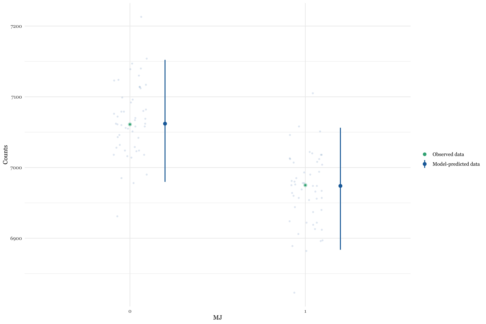
cat('<div style="color: black; font-size: 1em; margin-top: 0.25em;">
<span style="font-style: italic; ">Note.</span> Model-predicted intervals should include observed data points.
</div>')
cat('<br></br>')
```

This looks good - our model lines up well with the predicted model. Specifically, the observed data falls within the model-predicted intervals. This suggests that our model fits the assumptions of the underlying binomial distribution. 
#### Linearity (The logit of the probability is a linear function of the predictors.)

```{r linearity for match,echo=FALSE, results='asis'}

# This plot helps assess whether the model’s mean structure is correctly specified. It shows whether the predicted probabilities systematically differ from the observed outcomes across the range of fitted values. If the model is appropriate, the binned residuals should cluster around zero with no clear pattern. Systematic curves or trends would suggest that the link function or the functional form of one or more predictors may be misspecified.
cat('<div class="apa-figure-title">   <span class="figure-label">Figure X.</span><br>
  Check of Linearity Assumption (Binned Residuals)
</div>
')
knitr::include_graphics("figures/Study2_match_diagnostic_2.png")
cat('<div style="color: black; font-size: 1em; margin-top: 0.25em;">
<span style="font-style: italic; ">Note.</span> Points should be within error bounds.
</div>')
cat('<br></br>')

```

This isn't quite what we'd want to confirm that the linearity assumption hasn't been violated. So, let's do some further checks. First, let's look at the relationship in more detail to see if we can detect a non-linear relationship (i.e. that the residuals do not follow linearity).

```{r plotting linearity of predicted response for match, echo=FALSE, results='asis'}

cat('<div class="apa-figure-title">   <span class="figure-label">Figure X.</span><br>
  Checking the Residuals on the Plot of Predicted Probabilities of MJ
</div>
  ')
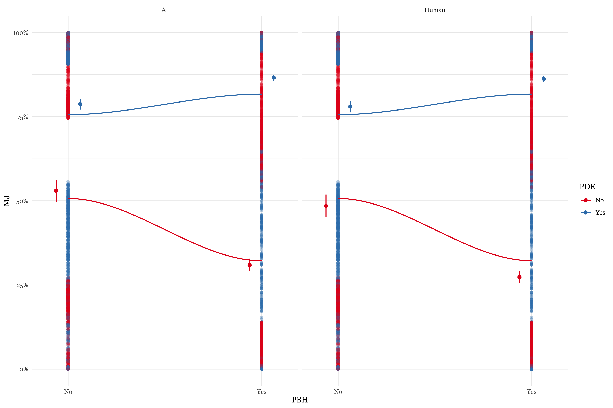
cat('<div style="color: black; font-size: 1em; margin-top: 0.25em;">
  <span style="font-style: italic; ">Note.</span> The dots are residuals and added lines are residual lines. 
</div>')
cat('<br></br>')
```

This looks pretty good. This, therefore, doesn't suggest a non-linear relationship. We've also already modelled all the interactions for the fixed factors. As a final check here, we can look at the effect of included the interactions for the random factor structure (though this threw a singularity issue, suggesting overfitting).

```{r plotting linearity of predicted response for match model w. red data, eval=FALSE, results='asis'}
match.pr <- predict_response(match.hVai, terms = c("PBH [all]","PDE [all] ","Agent [all]"))
cat('<div class="apa-figure-title">   <span class="figure-label">Figure X.</span><br>
  Checking the Residuals on the Plot of Predicted Probabilities of MJ for the Model with match RE Structure
</div>
  ')
plot(match.pr, show_residuals = TRUE, show_residuals_line = TRUE,grid=TRUE) + georgia_theme + theme(title = element_blank())
cat('<div style="color: black; font-size: 1em; margin-top: 0.25em;">
  <span style="font-style: italic; ">Note.</span> The dots are residuals and added lines are residual lines. 
</div>')
cat('<br></br>')
```

Although this does fit the data a *little* better, it doesn't make that much difference overall. As such plots of linearity should be taken with caution anyway, this helps us be more confident that we don't have a "lack of fit" issue.

#### Dispersion

(Binomial equivalent to checking for dispersion) The posterior predictive check also helps us check for dispersion. We already did this when checking the model fit. 
We can also test with the nonparametric dispersion test from DHARMa.

```{r dispersion check for match, echo=FALSE, results='asis'}
p <- testDispersion(hVai,plot=F) 
cat('**Written output of DHARMa nonparametric dispersion test via sd of residuals fitted vs. simulated :**', 
    '\n\n',
    'Dispersion:', p[["statistic"]],
    '\n\n',
    '*p*:', p[["p.value"]])
```
As we can see, this test of dispersion from the DHARMa package is non-significant, meaning there isn't any significant dispersion of our observed residuals to those of a normally distributed set of residuals. 
Together with our posterior predictive check analysis (and further steps taken as a result), we can rule out any concerns here. 

#### Outliers

```{r outliers for match,echo=FALSE, results='asis'}

# This plot helps assess whether the model’s mean structure is correctly specified. It shows whether the predicted probabilities systematically differ from the observed outcomes across the range of fitted values. If the model is appropriate, the binned residuals should cluster around zero with no clear pattern. Systematic curves or trends would suggest that the link function or the functional form of one or more predictors may be misspecified.
cat('<div class="apa-figure-title">   <span class="figure-label">Figure X.</span><br>
  Check for Outliers (Influential Observations)
</div>
')

cat('<div style="color: black; font-size: 1em; margin-top: 0.25em;">
<span style="font-style: italic; ">Note.</span> Points should be inside the contour lines.
</div>')
cat('<br></br>')

```

Before checking these influential observations individually, we tested whether the residuals significantly deviate from the expected uniform distribution under the model.  
```{r simsResid outliers for match, echo=FALSE,results='asis'}
simResid <- simulate_residuals(hVai)
out_obj <- performance::check_outliers(simResid)
cat('**Written output of outlier detection test:**', 
    '\n\n',
    'Proportion of observed outliers:', out_obj[["Coefficient"]],
    '\n\n',
    'Proportion of expected outliers:', out_obj[["Expected"]], '95% CI [', out_obj[["CI_low"]],',',out_obj[["CI_high"]],']',
    '\n\n',
    'No outliers were detected (*p*:', out_obj[["p_value"]],').')
```

As we can see, this does not flag any outliers, suggesting the highlighted cases in the Cook's distance plot, while influential, do not represent residual outliers.

#### Collinearity

```{r collinearity for match,echo=FALSE, results='asis'}

# This plot helps assess whether the model’s mean structure is correctly specified. It shows whether the predicted probabilities systematically differ from the observed outcomes across the range of fitted values. If the model is appropriate, the binned residuals should cluster around zero with no clear pattern. Systematic curves or trends would suggest that the link function or the functional form of one or more predictors may be misspecified.
cat('<div class="apa-figure-title">   <span class="figure-label">Figure X.</span><br>
  Check for Collinearity
</div>
  ')
knitr::include_graphics("figures/Study2_match_diagnostic_4.png")
cat('<div style="color: black; font-size: 1em; margin-top: 0.25em;">
  <span style="font-style: italic; ">Note.</span> High collinearity variation inflation factor (VIF) may inflate parameter uncertainty.
</div>')
cat('<br></br>')

```

The VIF's for all parameters are low which means that each predictor does not correlate with the other predictors in such a way that might suggest that the value of all additional predictors/parameters added to the model is low. This would be consistent with our model comparison findings, where we see that the matchest model we can fit has the lowest AIC and BIC values than all other match models. 

#### Normality of Residuals

```{r normality of resid for match,echo=FALSE, results='asis'}

# This plot helps assess whether the model’s mean structure is correctly specified. It shows whether the predicted probabilities systematically differ from the observed outcomes across the range of fitted values. If the model is appropriate, the binned residuals should cluster around zero with no clear pattern. Systematic curves or trends would suggest that the link function or the functional form of one or more predictors may be misspecified.
cat('<div class="apa-figure-title">   <span class="figure-label">Figure X.</span><br>
  Checking for Uniformity of Residuals (QQ Plot) 
</div>
')
knitr::include_graphics("figures/Study2_match_diagnostic_5.png")
cat('<div style="color: black; font-size: 1em; margin-top: 0.25em;">
<span style="font-style: italic; ">Note.</span> Points should be inside the contour lines.
</div>')
cat('<br></br>')

```
Our residuals show a good fit with the standard quantiles of a normal uniform distribution. 

#### Normality of Random Effects

##### Participants

```{r RE normality for match,echo=FALSE, results='asis'}

# Display the first plot
# Uniformity of Residuals
# Dots should fall along the lines
cat('<div class="apa-figure-title">   <span class="figure-label">Figure X.</span><br>
  Checking for Normality of Participants Random Effect 
</div>
')
knitr::include_graphics("figures/Study2_match_diagnostic_6.png")
cat('<div style="color: black; font-size: 1em; margin-top: 0.25em;">
<span style="font-style: italic; ">Note.</span> Dot should be plotted along the line.
</div>')
cat('<br></br>')
```

##### Dilemmas

```{r dilemma RE normality for match,echo=FALSE, results='asis'}

cat('<div class="apa-figure-title">   <span class="figure-label">Figure X.</span><br>
  Checking for Normality of Dilemmas Random Effect 
</div>
')
knitr::include_graphics("figures/Study2_match_diagnostic_7.png")
cat('<div style="color: black; font-size: 1em; margin-top: 0.25em;">
<span style="font-style: italic; ">Note.</span> Dot should be plotted along the line.
</div>')
cat('<br></br>')

```

Both of our random factors look good and fit the assumptions of a normal distribution. 

## Removing Participants who failed CR Human scenario and dilemmas with ambiguous MG predictions.
First, the GLMM model was fit with a reduced_match random effects structure.

```{r reduced_match model w. reduced_match RE structure, eval=FALSE,echo=TRUE}
full.hVai <- glmer(MJ ~ PBH*PDE*Agent +  (1+PBH*PDE*Agent|ID) + (1+Agent|dilemma),  data=reduced_df_match, family = binomial(link = "logit"),
                      control = glmerControl(optCtrl = list(maxfun = 2e5), optimizer = "bobyqa"))
```

```{r read in reduced_match model, echo=FALSE}
set.platform("outputs")
hVai <- readRDS("dropAgentIDdilRE_hVai_reduced_match_glmModel.rds")
```

This returned a singularity issue. Therefore, the complexity of the random effects structure was reduced_match (by order of importance) until no singularity warning was returned. The model below was the final fitted model.

```{r reduced_match model w. simplified RE structure, eval=FALSE,echo=TRUE}
hVai <- glmer(MJ ~ PBH*PDE*Agent +  (1+PBH+PDE|ID) + (1|Dilemma),  data=reduced_df_match, family = binomial(link = "logit"),
              control = glmerControl(optCtrl = list(maxfun = 2e5), optimizer = "bobyqa"))

#OR coefficients 
OR_hVai <- exp(fixef(hVai))
#CIs
ci_hVai <- confint(hVai, method = "Wald")
ci_hVai.or <- exp(ci_hVai)
ses_hVai <- sqrt(diag(vcov(hVai)))
```

```{r reduced_match model w. reduced_match RE structure from saved, echo=FALSE}
set.platform("outputs")
hVai <- readRDS("dropAgentIDdilRE_hVai_reduced_match_glmModel.rds")
#OR coefficients 
OR_hVai <- exp(fixef(hVai))
# confidence intervals for log-odds and OR
ci_hVai <- confint(hVai, method = "Wald") 
ci_hVai.or <- exp(ci_hVai)
ses_hVai <- sqrt(diag(vcov(hVai)))
```

```{r summary reduced_match,results='asis',echo=FALSE,cache=FALSE}

cat('
<div class="apa-table-title">
  <span class="table-label">Table 2.</span> Logistic GLMM Human v AI MJs explained by MG (OR)
</div>')
# OR table
tmp <- URLencode(paste(readLines("tables/Study2_reduced_match_regression_OR.html"), collapse="\n"))

cat('<iframe src="data:text/html;charset=utf-8,', tmp ,
    '" style="border: none; seamless:seamless; width: 800px; height: 200px"></iframe>')
cat('</td>')
cat('<td style="vertical-align:top; width:100%; padding:4px;">')
cat('<table style="width:100%; table-layout:fixed;"><tr>')
cat('<td style="vertical-align:top; width:100%; padding:10px;">')
cat('
<div class="apa-table-title">
  <span class="table-label">Table 1.</span> Logistic GLMM Human v AI MJs explained by MG (Log Odds)
</div>')
# log-odds table
tmp <- URLencode(paste(readLines("tables/Study2_reduced_match_regression_logodds.html"), collapse="\n"))

cat('<iframe src="data:text/html;charset=utf-8,', tmp ,
    '" style="border: none; seamless:seamless; width: 800px; height: 200px"></iframe>')
cat('</td></tr></table>')

```

```{r hVai reduced_match report,eval=FALSE}
hVai_report <- report(hVai)   
hVai_report
```


```{r plot models for reduced_match, echo=FALSE, results='asis',out.width="80%"}

# combine rows
cat(' <div class="apa-figure-title">   <span class="figure-label">Figure 1.</span><br>
  Predicted probabilities for PBH
</div>
')
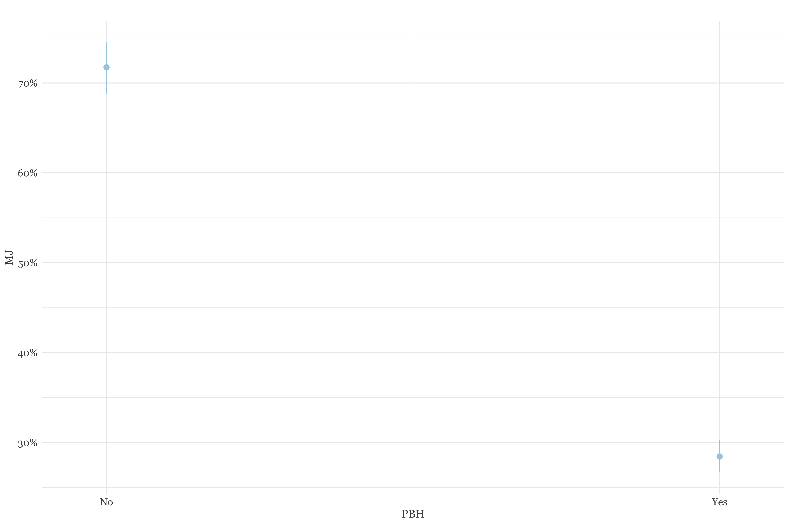
cat('<br></br>')
cat(' <div class="apa-figure-title">   <span class="figure-label">Figure 2.</span><br>
  Predicted probabilities for PDE
</div>
')
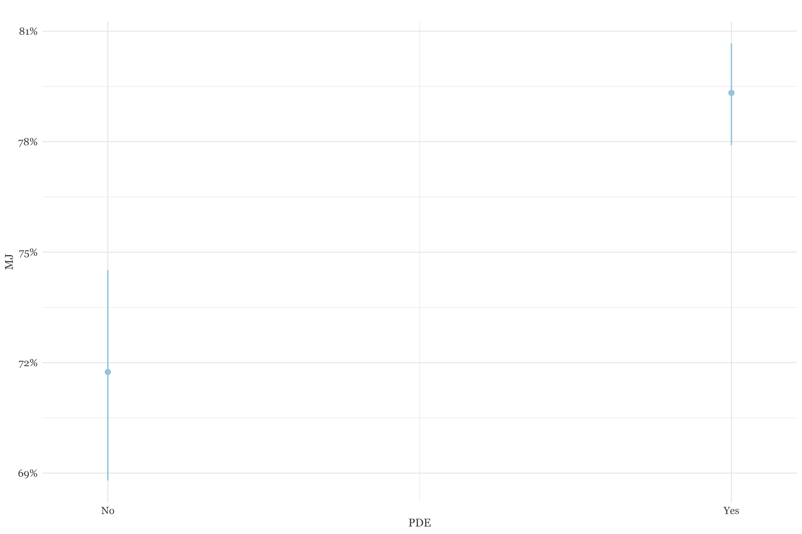
cat('<br></br>')
cat(' <div class="apa-figure-title">   <span class="figure-label">Figure 3.</span><br>
  Predicted probabilities for Agent
</div>
')
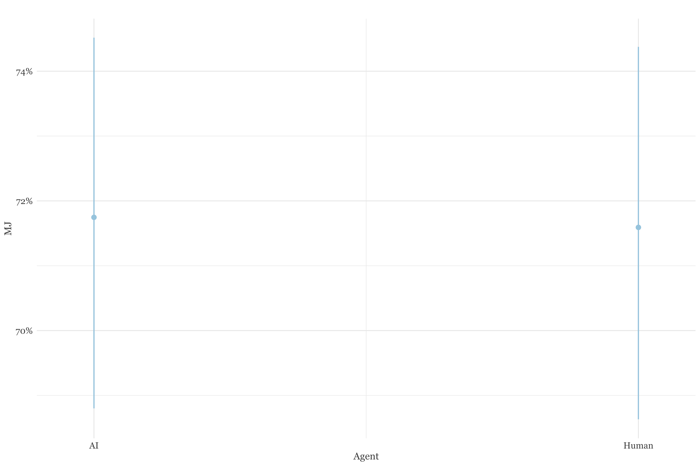
cat('<br></br>')
```

```{r interaction plots for reduced_match, echo=FALSE,results='asis'}

############################################################
# 2. INTERACTION PLOTS
############################################################

cat(' <div class="apa-figure-title">   <span class="figure-label">Figure 4.</span><br>
  Predicted probabilities for PBH x PDE
</div>
')
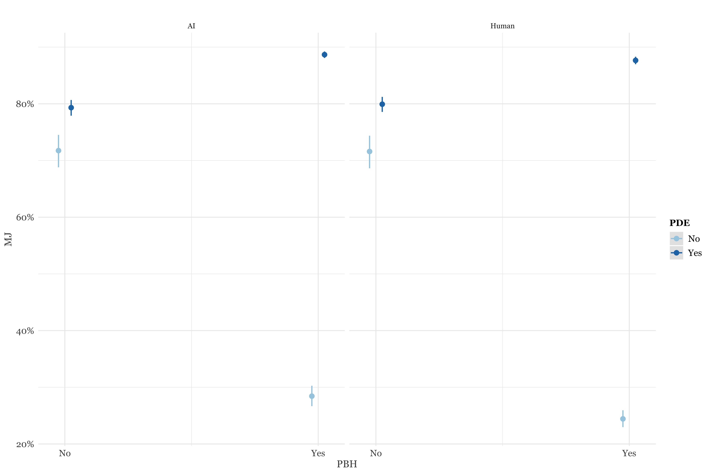
cat('<br></br>')
cat(' <div class="apa-figure-title">   <span class="figure-label">Figure 5.</span><br>
  Predicted probabilities for PBH x Agent
</div>
')
knitr::include_graphics("figures/Study2_reduced_match_interaction_PBH_Agent.png")
cat('<br></br>')
cat(' <div class="apa-figure-title">   <span class="figure-label">Figure 6.</span><br>
  Predicted probabilities for PDE x Agent
</div>
')
knitr::include_graphics("figures/Study2_reduced_match_interaction_PDE_Agent.png")
cat('<br></br>')
cat(' <div class="apa-figure-title">   <span class="figure-label">Figure 7.</span><br>
  Predicted probabilities for PBH x PDE x Agent
</div>
')
knitr::include_graphics("figures/Study2_reduced_match_interaction_plot.png")
cat('<br></br>')

```

### Estimated Marginal Means of Main Analysis (by factor)

```{r EMMs for reduced_match, echo=FALSE,warning=FALSE,results='asis'}
set.platform("tables")
cat('
<div class="apa-table-title">
  <span class="table-label">Table 3.</span> Estimated marginal means by PBH × PDE within Agent
</div>')
includeHTML("Study2_reduced_match_EMM_Agent.html")
cat('<br></br>')
cat('
<div class="apa-table-title">
  <span class="table-label">Table 4.</span> Estimated marginal means by PDE x Agent within PBH
</div>')
includeHTML("Study2_reduced_match_EMM_PBH.html")

cat('<br></br>')
cat('
<div class="apa-table-title">
  <span class="table-label">Table 5.</span> Estimated marginal means by Agent × PDE within PDE
</div>')
includeHTML("Study2_reduced_match_EMM_PDE.html")
cat('<br></br>')

cat('<br></br>')
cat('
<div class="apa-table-title">
  <span class="table-label">Table 4.</span> Estimated marginal means of PDE within PBH
</div>')
includeHTML("Study2_reduced_match_EMM_PBH.html")
cat('<br></br>')
```

#### Contrasts of EMMs

```{r contrasts for reduced_match, echo=FALSE, results='asis'}
set.platform("tables")
cat('
<div class="apa-table-title">
  <span class="table-label">Table 6.</span> Pairwise contrasts for PBH × PDE within Agent
</div>')
includeHTML("Study2_reduced_match_contrast_Agent.html")

cat('<br></br>')
cat('
<div class="apa-table-title">
  <span class="table-label">Table 7.</span> Pairwise contrasts for PBH × Agent within PBH
</div>')
includeHTML("Study2_reduced_match_contrast_PBH.html")


cat('<br></br>')
cat('
<div class="apa-table-title">
  <span class="table-label">Table 8.</span> Pairwise contrasts for PDE × Agent within PDE
</div>')
includeHTML("Study2_reduced_match_contrast_PDE.html")
cat('<br></br>')

```

### Two Sided Equivalence Test for Main Analysis

```{r toast w. what actually had power for, for reduced_match, echo=FALSE, results='asis'}

cat('<br></br>')
cat('
<div class="apa-table-title">
  <span class="table-label">Table 10.</span> TOST-test for Practical Equivalence for Main Model
</div>')
includeHTML("tables/Study2_reduced_match_TOST_table.html")
cat('<br></br>')
set.platform()
cat('<br></br>')
cat(' <div class="apa-figure-title">   <span class="figure-label">Figure 9.</span><br>
  TOST results for Main Analysis 
</div>
')
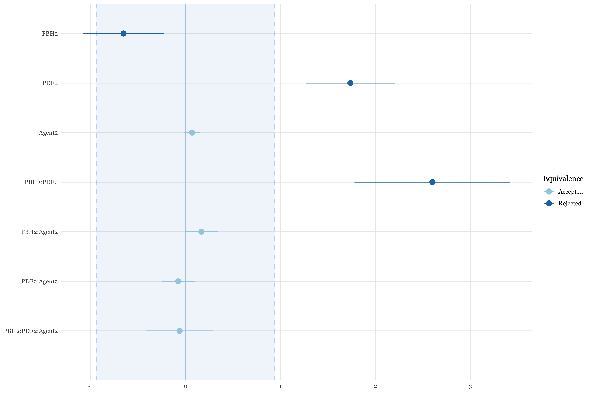
cat('<div style="color: black; font-size: 1em; margin-top: 0.25em;">
<span style="font-style: italic; ">Note.</span> Bounds set to mid-point value of small effect size boundary for log odds (±0.94). This is what the study was actually powered to detect for a three-way interaction. 
</div>')
cat('<br></br>')

```


### Model Comparisons


```{r model comp for reduced_match, eval=FALSE}
model_comp <- compare_performance(Agent, PBH, PDE, PBH_Agent, PDE_Agent, PBH_PDE, hVai)
```

```{r model comp from saved for reduced_match, echo=FALSE, results='asis'}
set.platform("tables")
cat('<br></br>')
cat('
<div class="apa-table-title">
  <span class="table-label">Table 17.</span> Comparison of logistic GLMMs with alternative fixed-factor combinations predicting moral judgments (with RE structure as in final model)
</div>')
includeHTML(("Study2_reduced_match_model_comparison.html"))
cat('<div style="color: black; font-size: 1em; margin-top: 0.25em;">
<span style="font-style: italic; ">Note.</span> Lower AIC and BIC indicate better fit.
</div>')
cat('<br></br>')

```


### Model Checks

#### Check Model Fit to Distribution

```{r model checks for reduced_match, echo=FALSE, results='asis'}

cat('<div class="apa-figure-title">   <span class="figure-label">Figure X.</span><br>
  Posterior Predictive Check
</div>
')

cat('<div style="color: black; font-size: 1em; margin-top: 0.25em;">
<span style="font-style: italic; ">Note.</span> Model-predicted intervals should include observed data points.
</div>')
cat('<br></br>')
```

This looks good - our model lines up well with the predicted model. Specifically, the observed data falls within the model-predicted intervals. This suggests that our model fits the assumptions of the underlying binomial distribution. 
#### Linearity (The logit of the probability is a linear function of the predictors.)

```{r linearity for reduced_match,echo=FALSE, results='asis'}

# This plot helps assess whether the model’s mean structure is correctly specified. It shows whether the predicted probabilities systematically differ from the observed outcomes across the range of fitted values. If the model is appropriate, the binned residuals should cluster around zero with no clear pattern. Systematic curves or trends would suggest that the link function or the functional form of one or more predictors may be misspecified.
cat('<div class="apa-figure-title">   <span class="figure-label">Figure X.</span><br>
  Check of Linearity Assumption (Binned Residuals)
</div>
')
knitr::include_graphics("figures/Study2_reduced_match_diagnostic_2.png")
cat('<div style="color: black; font-size: 1em; margin-top: 0.25em;">
<span style="font-style: italic; ">Note.</span> Points should be within error bounds.
</div>')
cat('<br></br>')

```

This isn't quite what we'd want to confirm that the linearity assumption hasn't been violated. So, let's do some further checks. First, let's look at the relationship in more detail to see if we can detect a non-linear relationship (i.e. that the residuals do not follow linearity).

```{r plotting linearity of predicted response for reduced_match, echo=FALSE, results='asis'}

cat('<div class="apa-figure-title">   <span class="figure-label">Figure X.</span><br>
  Checking the Residuals on the Plot of Predicted Probabilities of MJ
</div>
  ')
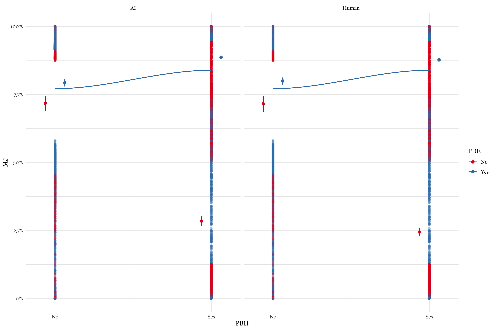
cat('<div style="color: black; font-size: 1em; margin-top: 0.25em;">
  <span style="font-style: italic; ">Note.</span> The dots are residuals and added lines are residual lines. 
</div>')
cat('<br></br>')
```

This looks pretty good. This, therefore, doesn't suggest a non-linear relationship. We've also already modelled all the interactions for the fixed factors. As a final check here, we can look at the effect of included the interactions for the random factor structure (though this threw a singularity issue, suggesting overfitting).

```{r plotting linearity of predicted response for reduced_match model w. red data, eval=FALSE, results='asis'}
reduced_match.pr <- predict_response(reduced_match.hVai, terms = c("PBH [all]","PDE [all] ","Agent [all]"))
cat('<div class="apa-figure-title">   <span class="figure-label">Figure X.</span><br>
  Checking the Residuals on the Plot of Predicted Probabilities of MJ for the Model with reduced_match RE Structure
</div>
  ')
plot(reduced_match.pr, show_residuals = TRUE, show_residuals_line = TRUE,grid=TRUE) + georgia_theme + theme(title = element_blank())
cat('<div style="color: black; font-size: 1em; margin-top: 0.25em;">
  <span style="font-style: italic; ">Note.</span> The dots are residuals and added lines are residual lines. 
</div>')
cat('<br></br>')
```

Although this does fit the data a *little* better, it doesn't make that much difference overall. As such plots of linearity should be taken with caution anyway, this helps us be more confident that we don't have a "lack of fit" issue.

#### Dispersion

(Binomial equivalent to checking for dispersion) The posterior predictive check also helps us check for dispersion. We already did this when checking the model fit. 
We can also test with the nonparametric dispersion test from DHARMa.

```{r dispersion check for reduced_match, echo=FALSE, results='asis'}
p <- testDispersion(hVai,plot=F) 
cat('**Written output of DHARMa nonparametric dispersion test via sd of residuals fitted vs. simulated :**', 
    '\n\n',
    'Dispersion:', p[["statistic"]],
    '\n\n',
    '*p*:', p[["p.value"]])
```
As we can see, this test of dispersion from the DHARMa package is non-significant, meaning there isn't any significant dispersion of our observed residuals to those of a normally distributed set of residuals. 
Together with our posterior predictive check analysis (and further steps taken as a result), we can rule out any concerns here. 

#### Outliers

```{r outliers for reduced_match,echo=FALSE, results='asis'}

# This plot helps assess whether the model’s mean structure is correctly specified. It shows whether the predicted probabilities systematically differ from the observed outcomes across the range of fitted values. If the model is appropriate, the binned residuals should cluster around zero with no clear pattern. Systematic curves or trends would suggest that the link function or the functional form of one or more predictors may be misspecified.
cat('<div class="apa-figure-title">   <span class="figure-label">Figure X.</span><br>
  Check for Outliers (Influential Observations)
</div>
')

cat('<div style="color: black; font-size: 1em; margin-top: 0.25em;">
<span style="font-style: italic; ">Note.</span> Points should be inside the contour lines.
</div>')
cat('<br></br>')

```

Before checking these influential observations individually, we tested whether the residuals significantly deviate from the expected uniform distribution under the model.  
```{r simsResid outliers for reduced_match, echo=FALSE,results='asis'}
simResid <- simulate_residuals(hVai)
out_obj <- performance::check_outliers(simResid)
cat('**Written output of outlier detection test:**', 
    '\n\n',
    'Proportion of observed outliers:', out_obj[["Coefficient"]],
    '\n\n',
    'Proportion of expected outliers:', out_obj[["Expected"]], '95% CI [', out_obj[["CI_low"]],',',out_obj[["CI_high"]],']',
    '\n\n',
    'No outliers were detected (*p*:', out_obj[["p_value"]],').')
```

As we can see, this does not flag any outliers, suggesting the highlighted cases in the Cook's distance plot, while influential, do not represent residual outliers.

#### Collinearity

```{r collinearity for reduced_match,echo=FALSE, results='asis'}

# This plot helps assess whether the model’s mean structure is correctly specified. It shows whether the predicted probabilities systematically differ from the observed outcomes across the range of fitted values. If the model is appropriate, the binned residuals should cluster around zero with no clear pattern. Systematic curves or trends would suggest that the link function or the functional form of one or more predictors may be misspecified.
cat('<div class="apa-figure-title">   <span class="figure-label">Figure X.</span><br>
  Check for Collinearity
</div>
  ')
knitr::include_graphics("figures/Study2_reduced_match_diagnostic_4.png")
cat('<div style="color: black; font-size: 1em; margin-top: 0.25em;">
  <span style="font-style: italic; ">Note.</span> High collinearity variation inflation factor (VIF) may inflate parameter uncertainty.
</div>')
cat('<br></br>')

```

The VIF's for all parameters are low which means that each predictor does not correlate with the other predictors in such a way that might suggest that the value of all additional predictors/parameters added to the model is low. This would be consistent with our model comparison findings, where we see that the reduced_matchest model we can fit has the lowest AIC and BIC values than all other reduced_match models. 

#### Normality of Residuals

```{r normality of resid for reduced_match,echo=FALSE, results='asis'}

# This plot helps assess whether the model’s mean structure is correctly specified. It shows whether the predicted probabilities systematically differ from the observed outcomes across the range of fitted values. If the model is appropriate, the binned residuals should cluster around zero with no clear pattern. Systematic curves or trends would suggest that the link function or the functional form of one or more predictors may be misspecified.
cat('<div class="apa-figure-title">   <span class="figure-label">Figure X.</span><br>
  Checking for Uniformity of Residuals (QQ Plot) 
</div>
')
knitr::include_graphics("figures/Study2_reduced_match_diagnostic_5.png")
cat('<div style="color: black; font-size: 1em; margin-top: 0.25em;">
<span style="font-style: italic; ">Note.</span> Points should be inside the contour lines.
</div>')
cat('<br></br>')

```
Our residuals show a good fit with the standard quantiles of a normal uniform distribution. 

#### Normality of Random Effects

##### Participants

```{r RE normality for reduced_match,echo=FALSE, results='asis'}

# Display the first plot
# Uniformity of Residuals
# Dots should fall along the lines
cat('<div class="apa-figure-title">   <span class="figure-label">Figure X.</span><br>
  Checking for Normality of Participants Random Effect 
</div>
')
knitr::include_graphics("figures/Study2_reduced_match_diagnostic_6.png")
cat('<div style="color: black; font-size: 1em; margin-top: 0.25em;">
<span style="font-style: italic; ">Note.</span> Dot should be plotted along the line.
</div>')
cat('<br></br>')
```

##### Dilemmas

```{r dilemma RE normality for reduced_match,echo=FALSE, results='asis'}

cat('<div class="apa-figure-title">   <span class="figure-label">Figure X.</span><br>
  Checking for Normality of Dilemmas Random Effect 
</div>
')
knitr::include_graphics("figures/Study2_reduced_match_diagnostic_7.png")
cat('<div style="color: black; font-size: 1em; margin-top: 0.25em;">
<span style="font-style: italic; ">Note.</span> Dot should be plotted along the line.
</div>')
cat('<br></br>')

```

Both of our random factors look good and fit the assumptions of a normal distribution. 